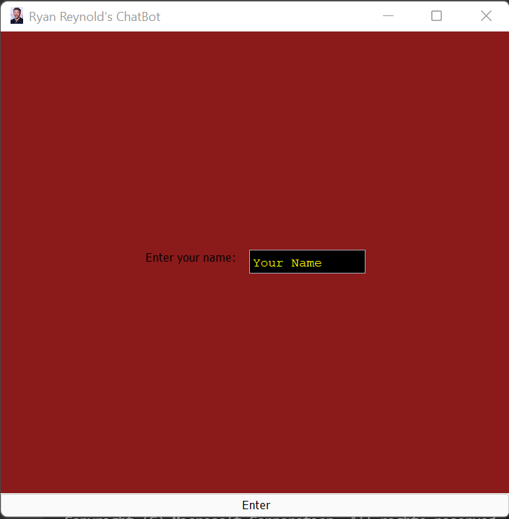
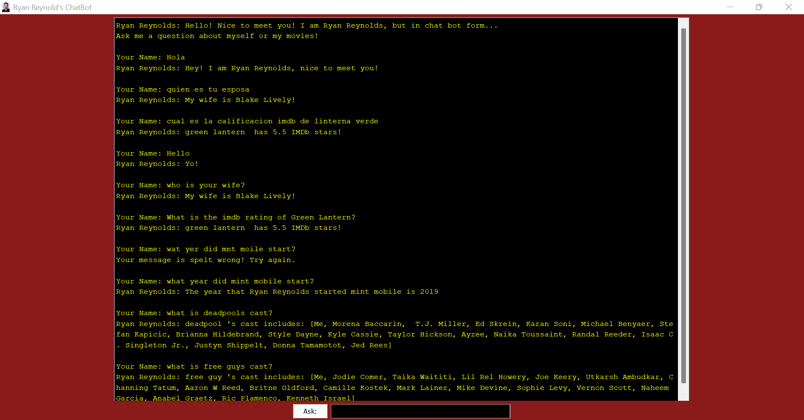

<h1 align="center"> Ryan Reynolds Chat Bot </h1>
<h2 align="center"> COSC 310 - INDIVIDUAL PORTION</h2>
<h3 align="center">By Lance Rogan, 62708938</h3>
<h3 align="center">Group members for the group work: Blake Ablitt, Ben Van Bergeyk,  Griffin Wilchuk, and Carla Mather </h3>

   <h2>Pre GUI Example</h2>
 
  
 <h2>Main GUI Example</h2>
 
  
 <h2>Video Demonstration</h2>
  

https://user-images.githubusercontent.com/77311869/162816564-16eab225-01bd-4bf2-a999-e76447f4489b.mp4

  
 
 
<a href="https://www.imdb.com/name/nm0005351/">Learn more about Ryan Reynolds</a>
    
<html xmlns:v="urn:schemas-microsoft-com:vml"
xmlns:o="urn:schemas-microsoft-com:office:office"
xmlns:w="urn:schemas-microsoft-com:office:word"
xmlns:m="http://schemas.microsoft.com/office/2004/12/omml"
xmlns="http://www.w3.org/TR/REC-html40">

<head>
<meta http-equiv=Content-Type content="text/html; charset=windows-1252">
<meta name=ProgId content=Word.Document>
<meta name=Generator content="Microsoft Word 15">
<meta name=Originator content="Microsoft Word 15">
<link rel=File-List
href="COSC%20310%20-%20Individual%20Project%20HTML%20VERSION_files/filelist.xml">
<title>COSC 310 - Individual Project</title>
<!--[if gte mso 9]><xml>
 <o:DocumentProperties>
  <o:Author>Lance Rogan</o:Author>
  <o:Template>Normal</o:Template>
  <o:LastAuthor>Lance Rogan</o:LastAuthor>
  <o:Revision>2</o:Revision>
  <o:LastPrinted>2022-04-11T17:37:00Z</o:LastPrinted>
  <o:Created>2022-04-11T17:41:00Z</o:Created>
  <o:LastSaved>2022-04-11T17:41:00Z</o:LastSaved>
  <o:Pages>19</o:Pages>
  <o:Words>7803</o:Words>
  <o:Characters>44479</o:Characters>
  <o:Lines>370</o:Lines>
  <o:Paragraphs>104</o:Paragraphs>
  <o:CharactersWithSpaces>52178</o:CharactersWithSpaces>
  <o:Version>16.00</o:Version>
 </o:DocumentProperties>
 <o:OfficeDocumentSettings>
  <o:AllowPNG/>
 </o:OfficeDocumentSettings>
</xml><![endif]-->
<link rel=dataStoreItem
href="COSC%20310%20-%20Individual%20Project%20HTML%20VERSION_files/item0001.xml"
target="COSC%20310%20-%20Individual%20Project%20HTML%20VERSION_files/props002.xml">
<link rel=themeData
href="COSC%20310%20-%20Individual%20Project%20HTML%20VERSION_files/themedata.thmx">
<link rel=colorSchemeMapping
href="COSC%20310%20-%20Individual%20Project%20HTML%20VERSION_files/colorschememapping.xml">
<!--[if gte mso 9]><xml>
 <w:WordDocument>
  <w:SpellingState>Clean</w:SpellingState>
  <w:TrackMoves/>
  <w:TrackFormatting/>
  <w:PunctuationKerning/>
  <w:ValidateAgainstSchemas/>
  <w:SaveIfXMLInvalid>false</w:SaveIfXMLInvalid>
  <w:IgnoreMixedContent>false</w:IgnoreMixedContent>
  <w:AlwaysShowPlaceholderText>false</w:AlwaysShowPlaceholderText>
  <w:DoNotPromoteQF/>
  <w:LidThemeOther>EN-CA</w:LidThemeOther>
  <w:LidThemeAsian>X-NONE</w:LidThemeAsian>
  <w:LidThemeComplexScript>X-NONE</w:LidThemeComplexScript>
  <w:Compatibility>
   <w:BreakWrappedTables/>
   <w:SnapToGridInCell/>
   <w:WrapTextWithPunct/>
   <w:UseAsianBreakRules/>
   <w:DontGrowAutofit/>
   <w:SplitPgBreakAndParaMark/>
   <w:EnableOpenTypeKerning/>
   <w:DontFlipMirrorIndents/>
   <w:OverrideTableStyleHps/>
  </w:Compatibility>
  <m:mathPr>
   <m:mathFont m:val="Cambria Math"/>
   <m:brkBin m:val="before"/>
   <m:brkBinSub m:val="&#45;-"/>
   <m:smallFrac m:val="off"/>
   <m:dispDef/>
   <m:lMargin m:val="0"/>
   <m:rMargin m:val="0"/>
   <m:defJc m:val="centerGroup"/>
   <m:wrapIndent m:val="1440"/>
   <m:intLim m:val="subSup"/>
   <m:naryLim m:val="undOvr"/>
  </m:mathPr></w:WordDocument>
</xml><![endif]--><!--[if gte mso 9]><xml>
 <w:LatentStyles DefLockedState="false" DefUnhideWhenUsed="false"
  DefSemiHidden="false" DefQFormat="false" DefPriority="99"
  LatentStyleCount="376">
  <w:LsdException Locked="false" Priority="0" QFormat="true" Name="Normal"/>
  <w:LsdException Locked="false" Priority="9" QFormat="true" Name="heading 1"/>
  <w:LsdException Locked="false" Priority="9" SemiHidden="true"
   UnhideWhenUsed="true" QFormat="true" Name="heading 2"/>
  <w:LsdException Locked="false" Priority="9" SemiHidden="true"
   UnhideWhenUsed="true" QFormat="true" Name="heading 3"/>
  <w:LsdException Locked="false" Priority="9" SemiHidden="true"
   UnhideWhenUsed="true" QFormat="true" Name="heading 4"/>
  <w:LsdException Locked="false" Priority="9" SemiHidden="true"
   UnhideWhenUsed="true" QFormat="true" Name="heading 5"/>
  <w:LsdException Locked="false" Priority="9" SemiHidden="true"
   UnhideWhenUsed="true" QFormat="true" Name="heading 6"/>
  <w:LsdException Locked="false" Priority="9" SemiHidden="true"
   UnhideWhenUsed="true" QFormat="true" Name="heading 7"/>
  <w:LsdException Locked="false" Priority="9" SemiHidden="true"
   UnhideWhenUsed="true" QFormat="true" Name="heading 8"/>
  <w:LsdException Locked="false" Priority="9" SemiHidden="true"
   UnhideWhenUsed="true" QFormat="true" Name="heading 9"/>
  <w:LsdException Locked="false" SemiHidden="true" UnhideWhenUsed="true"
   Name="index 1"/>
  <w:LsdException Locked="false" SemiHidden="true" UnhideWhenUsed="true"
   Name="index 2"/>
  <w:LsdException Locked="false" SemiHidden="true" UnhideWhenUsed="true"
   Name="index 3"/>
  <w:LsdException Locked="false" SemiHidden="true" UnhideWhenUsed="true"
   Name="index 4"/>
  <w:LsdException Locked="false" SemiHidden="true" UnhideWhenUsed="true"
   Name="index 5"/>
  <w:LsdException Locked="false" SemiHidden="true" UnhideWhenUsed="true"
   Name="index 6"/>
  <w:LsdException Locked="false" SemiHidden="true" UnhideWhenUsed="true"
   Name="index 7"/>
  <w:LsdException Locked="false" SemiHidden="true" UnhideWhenUsed="true"
   Name="index 8"/>
  <w:LsdException Locked="false" SemiHidden="true" UnhideWhenUsed="true"
   Name="index 9"/>
  <w:LsdException Locked="false" Priority="39" SemiHidden="true"
   UnhideWhenUsed="true" Name="toc 1"/>
  <w:LsdException Locked="false" Priority="39" SemiHidden="true"
   UnhideWhenUsed="true" Name="toc 2"/>
  <w:LsdException Locked="false" Priority="39" SemiHidden="true"
   UnhideWhenUsed="true" Name="toc 3"/>
  <w:LsdException Locked="false" Priority="39" SemiHidden="true"
   UnhideWhenUsed="true" Name="toc 4"/>
  <w:LsdException Locked="false" Priority="39" SemiHidden="true"
   UnhideWhenUsed="true" Name="toc 5"/>
  <w:LsdException Locked="false" Priority="39" SemiHidden="true"
   UnhideWhenUsed="true" Name="toc 6"/>
  <w:LsdException Locked="false" Priority="39" SemiHidden="true"
   UnhideWhenUsed="true" Name="toc 7"/>
  <w:LsdException Locked="false" Priority="39" SemiHidden="true"
   UnhideWhenUsed="true" Name="toc 8"/>
  <w:LsdException Locked="false" Priority="39" SemiHidden="true"
   UnhideWhenUsed="true" Name="toc 9"/>
  <w:LsdException Locked="false" SemiHidden="true" UnhideWhenUsed="true"
   Name="Normal Indent"/>
  <w:LsdException Locked="false" SemiHidden="true" UnhideWhenUsed="true"
   Name="footnote text"/>
  <w:LsdException Locked="false" SemiHidden="true" UnhideWhenUsed="true"
   Name="annotation text"/>
  <w:LsdException Locked="false" SemiHidden="true" UnhideWhenUsed="true"
   Name="header"/>
  <w:LsdException Locked="false" SemiHidden="true" UnhideWhenUsed="true"
   Name="footer"/>
  <w:LsdException Locked="false" SemiHidden="true" UnhideWhenUsed="true"
   Name="index heading"/>
  <w:LsdException Locked="false" Priority="35" SemiHidden="true"
   UnhideWhenUsed="true" QFormat="true" Name="caption"/>
  <w:LsdException Locked="false" SemiHidden="true" UnhideWhenUsed="true"
   Name="table of figures"/>
  <w:LsdException Locked="false" SemiHidden="true" UnhideWhenUsed="true"
   Name="envelope address"/>
  <w:LsdException Locked="false" SemiHidden="true" UnhideWhenUsed="true"
   Name="envelope return"/>
  <w:LsdException Locked="false" SemiHidden="true" UnhideWhenUsed="true"
   Name="footnote reference"/>
  <w:LsdException Locked="false" SemiHidden="true" UnhideWhenUsed="true"
   Name="annotation reference"/>
  <w:LsdException Locked="false" SemiHidden="true" UnhideWhenUsed="true"
   Name="line number"/>
  <w:LsdException Locked="false" SemiHidden="true" UnhideWhenUsed="true"
   Name="page number"/>
  <w:LsdException Locked="false" SemiHidden="true" UnhideWhenUsed="true"
   Name="endnote reference"/>
  <w:LsdException Locked="false" SemiHidden="true" UnhideWhenUsed="true"
   Name="endnote text"/>
  <w:LsdException Locked="false" SemiHidden="true" UnhideWhenUsed="true"
   Name="table of authorities"/>
  <w:LsdException Locked="false" SemiHidden="true" UnhideWhenUsed="true"
   Name="macro"/>
  <w:LsdException Locked="false" SemiHidden="true" UnhideWhenUsed="true"
   Name="toa heading"/>
  <w:LsdException Locked="false" SemiHidden="true" UnhideWhenUsed="true"
   Name="List"/>
  <w:LsdException Locked="false" SemiHidden="true" UnhideWhenUsed="true"
   Name="List Bullet"/>
  <w:LsdException Locked="false" SemiHidden="true" UnhideWhenUsed="true"
   Name="List Number"/>
  <w:LsdException Locked="false" SemiHidden="true" UnhideWhenUsed="true"
   Name="List 2"/>
  <w:LsdException Locked="false" SemiHidden="true" UnhideWhenUsed="true"
   Name="List 3"/>
  <w:LsdException Locked="false" SemiHidden="true" UnhideWhenUsed="true"
   Name="List 4"/>
  <w:LsdException Locked="false" SemiHidden="true" UnhideWhenUsed="true"
   Name="List 5"/>
  <w:LsdException Locked="false" SemiHidden="true" UnhideWhenUsed="true"
   Name="List Bullet 2"/>
  <w:LsdException Locked="false" SemiHidden="true" UnhideWhenUsed="true"
   Name="List Bullet 3"/>
  <w:LsdException Locked="false" SemiHidden="true" UnhideWhenUsed="true"
   Name="List Bullet 4"/>
  <w:LsdException Locked="false" SemiHidden="true" UnhideWhenUsed="true"
   Name="List Bullet 5"/>
  <w:LsdException Locked="false" SemiHidden="true" UnhideWhenUsed="true"
   Name="List Number 2"/>
  <w:LsdException Locked="false" SemiHidden="true" UnhideWhenUsed="true"
   Name="List Number 3"/>
  <w:LsdException Locked="false" SemiHidden="true" UnhideWhenUsed="true"
   Name="List Number 4"/>
  <w:LsdException Locked="false" SemiHidden="true" UnhideWhenUsed="true"
   Name="List Number 5"/>
  <w:LsdException Locked="false" Priority="10" QFormat="true" Name="Title"/>
  <w:LsdException Locked="false" SemiHidden="true" UnhideWhenUsed="true"
   Name="Closing"/>
  <w:LsdException Locked="false" SemiHidden="true" UnhideWhenUsed="true"
   Name="Signature"/>
  <w:LsdException Locked="false" Priority="1" SemiHidden="true"
   UnhideWhenUsed="true" Name="Default Paragraph Font"/>
  <w:LsdException Locked="false" SemiHidden="true" UnhideWhenUsed="true"
   Name="Body Text"/>
  <w:LsdException Locked="false" SemiHidden="true" UnhideWhenUsed="true"
   Name="Body Text Indent"/>
  <w:LsdException Locked="false" SemiHidden="true" UnhideWhenUsed="true"
   Name="List Continue"/>
  <w:LsdException Locked="false" SemiHidden="true" UnhideWhenUsed="true"
   Name="List Continue 2"/>
  <w:LsdException Locked="false" SemiHidden="true" UnhideWhenUsed="true"
   Name="List Continue 3"/>
  <w:LsdException Locked="false" SemiHidden="true" UnhideWhenUsed="true"
   Name="List Continue 4"/>
  <w:LsdException Locked="false" SemiHidden="true" UnhideWhenUsed="true"
   Name="List Continue 5"/>
  <w:LsdException Locked="false" SemiHidden="true" UnhideWhenUsed="true"
   Name="Message Header"/>
  <w:LsdException Locked="false" Priority="11" QFormat="true" Name="Subtitle"/>
  <w:LsdException Locked="false" SemiHidden="true" UnhideWhenUsed="true"
   Name="Salutation"/>
  <w:LsdException Locked="false" SemiHidden="true" UnhideWhenUsed="true"
   Name="Date"/>
  <w:LsdException Locked="false" SemiHidden="true" UnhideWhenUsed="true"
   Name="Body Text First Indent"/>
  <w:LsdException Locked="false" SemiHidden="true" UnhideWhenUsed="true"
   Name="Body Text First Indent 2"/>
  <w:LsdException Locked="false" SemiHidden="true" UnhideWhenUsed="true"
   Name="Note Heading"/>
  <w:LsdException Locked="false" SemiHidden="true" UnhideWhenUsed="true"
   Name="Body Text 2"/>
  <w:LsdException Locked="false" SemiHidden="true" UnhideWhenUsed="true"
   Name="Body Text 3"/>
  <w:LsdException Locked="false" SemiHidden="true" UnhideWhenUsed="true"
   Name="Body Text Indent 2"/>
  <w:LsdException Locked="false" SemiHidden="true" UnhideWhenUsed="true"
   Name="Body Text Indent 3"/>
  <w:LsdException Locked="false" SemiHidden="true" UnhideWhenUsed="true"
   Name="Block Text"/>
  <w:LsdException Locked="false" SemiHidden="true" UnhideWhenUsed="true"
   Name="Hyperlink"/>
  <w:LsdException Locked="false" SemiHidden="true" UnhideWhenUsed="true"
   Name="FollowedHyperlink"/>
  <w:LsdException Locked="false" Priority="22" QFormat="true" Name="Strong"/>
  <w:LsdException Locked="false" Priority="20" QFormat="true" Name="Emphasis"/>
  <w:LsdException Locked="false" SemiHidden="true" UnhideWhenUsed="true"
   Name="Document Map"/>
  <w:LsdException Locked="false" SemiHidden="true" UnhideWhenUsed="true"
   Name="Plain Text"/>
  <w:LsdException Locked="false" SemiHidden="true" UnhideWhenUsed="true"
   Name="E-mail Signature"/>
  <w:LsdException Locked="false" SemiHidden="true" UnhideWhenUsed="true"
   Name="HTML Top of Form"/>
  <w:LsdException Locked="false" SemiHidden="true" UnhideWhenUsed="true"
   Name="HTML Bottom of Form"/>
  <w:LsdException Locked="false" SemiHidden="true" UnhideWhenUsed="true"
   Name="Normal (Web)"/>
  <w:LsdException Locked="false" SemiHidden="true" UnhideWhenUsed="true"
   Name="HTML Acronym"/>
  <w:LsdException Locked="false" SemiHidden="true" UnhideWhenUsed="true"
   Name="HTML Address"/>
  <w:LsdException Locked="false" SemiHidden="true" UnhideWhenUsed="true"
   Name="HTML Cite"/>
  <w:LsdException Locked="false" SemiHidden="true" UnhideWhenUsed="true"
   Name="HTML Code"/>
  <w:LsdException Locked="false" SemiHidden="true" UnhideWhenUsed="true"
   Name="HTML Definition"/>
  <w:LsdException Locked="false" SemiHidden="true" UnhideWhenUsed="true"
   Name="HTML Keyboard"/>
  <w:LsdException Locked="false" SemiHidden="true" UnhideWhenUsed="true"
   Name="HTML Preformatted"/>
  <w:LsdException Locked="false" SemiHidden="true" UnhideWhenUsed="true"
   Name="HTML Sample"/>
  <w:LsdException Locked="false" SemiHidden="true" UnhideWhenUsed="true"
   Name="HTML Typewriter"/>
  <w:LsdException Locked="false" SemiHidden="true" UnhideWhenUsed="true"
   Name="HTML Variable"/>
  <w:LsdException Locked="false" SemiHidden="true" UnhideWhenUsed="true"
   Name="Normal Table"/>
  <w:LsdException Locked="false" SemiHidden="true" UnhideWhenUsed="true"
   Name="annotation subject"/>
  <w:LsdException Locked="false" SemiHidden="true" UnhideWhenUsed="true"
   Name="No List"/>
  <w:LsdException Locked="false" SemiHidden="true" UnhideWhenUsed="true"
   Name="Outline List 1"/>
  <w:LsdException Locked="false" SemiHidden="true" UnhideWhenUsed="true"
   Name="Outline List 2"/>
  <w:LsdException Locked="false" SemiHidden="true" UnhideWhenUsed="true"
   Name="Outline List 3"/>
  <w:LsdException Locked="false" SemiHidden="true" UnhideWhenUsed="true"
   Name="Table Simple 1"/>
  <w:LsdException Locked="false" SemiHidden="true" UnhideWhenUsed="true"
   Name="Table Simple 2"/>
  <w:LsdException Locked="false" SemiHidden="true" UnhideWhenUsed="true"
   Name="Table Simple 3"/>
  <w:LsdException Locked="false" SemiHidden="true" UnhideWhenUsed="true"
   Name="Table Classic 1"/>
  <w:LsdException Locked="false" SemiHidden="true" UnhideWhenUsed="true"
   Name="Table Classic 2"/>
  <w:LsdException Locked="false" SemiHidden="true" UnhideWhenUsed="true"
   Name="Table Classic 3"/>
  <w:LsdException Locked="false" SemiHidden="true" UnhideWhenUsed="true"
   Name="Table Classic 4"/>
  <w:LsdException Locked="false" SemiHidden="true" UnhideWhenUsed="true"
   Name="Table Colorful 1"/>
  <w:LsdException Locked="false" SemiHidden="true" UnhideWhenUsed="true"
   Name="Table Colorful 2"/>
  <w:LsdException Locked="false" SemiHidden="true" UnhideWhenUsed="true"
   Name="Table Colorful 3"/>
  <w:LsdException Locked="false" SemiHidden="true" UnhideWhenUsed="true"
   Name="Table Columns 1"/>
  <w:LsdException Locked="false" SemiHidden="true" UnhideWhenUsed="true"
   Name="Table Columns 2"/>
  <w:LsdException Locked="false" SemiHidden="true" UnhideWhenUsed="true"
   Name="Table Columns 3"/>
  <w:LsdException Locked="false" SemiHidden="true" UnhideWhenUsed="true"
   Name="Table Columns 4"/>
  <w:LsdException Locked="false" SemiHidden="true" UnhideWhenUsed="true"
   Name="Table Columns 5"/>
  <w:LsdException Locked="false" SemiHidden="true" UnhideWhenUsed="true"
   Name="Table Grid 1"/>
  <w:LsdException Locked="false" SemiHidden="true" UnhideWhenUsed="true"
   Name="Table Grid 2"/>
  <w:LsdException Locked="false" SemiHidden="true" UnhideWhenUsed="true"
   Name="Table Grid 3"/>
  <w:LsdException Locked="false" SemiHidden="true" UnhideWhenUsed="true"
   Name="Table Grid 4"/>
  <w:LsdException Locked="false" SemiHidden="true" UnhideWhenUsed="true"
   Name="Table Grid 5"/>
  <w:LsdException Locked="false" SemiHidden="true" UnhideWhenUsed="true"
   Name="Table Grid 6"/>
  <w:LsdException Locked="false" SemiHidden="true" UnhideWhenUsed="true"
   Name="Table Grid 7"/>
  <w:LsdException Locked="false" SemiHidden="true" UnhideWhenUsed="true"
   Name="Table Grid 8"/>
  <w:LsdException Locked="false" SemiHidden="true" UnhideWhenUsed="true"
   Name="Table List 1"/>
  <w:LsdException Locked="false" SemiHidden="true" UnhideWhenUsed="true"
   Name="Table List 2"/>
  <w:LsdException Locked="false" SemiHidden="true" UnhideWhenUsed="true"
   Name="Table List 3"/>
  <w:LsdException Locked="false" SemiHidden="true" UnhideWhenUsed="true"
   Name="Table List 4"/>
  <w:LsdException Locked="false" SemiHidden="true" UnhideWhenUsed="true"
   Name="Table List 5"/>
  <w:LsdException Locked="false" SemiHidden="true" UnhideWhenUsed="true"
   Name="Table List 6"/>
  <w:LsdException Locked="false" SemiHidden="true" UnhideWhenUsed="true"
   Name="Table List 7"/>
  <w:LsdException Locked="false" SemiHidden="true" UnhideWhenUsed="true"
   Name="Table List 8"/>
  <w:LsdException Locked="false" SemiHidden="true" UnhideWhenUsed="true"
   Name="Table 3D effects 1"/>
  <w:LsdException Locked="false" SemiHidden="true" UnhideWhenUsed="true"
   Name="Table 3D effects 2"/>
  <w:LsdException Locked="false" SemiHidden="true" UnhideWhenUsed="true"
   Name="Table 3D effects 3"/>
  <w:LsdException Locked="false" SemiHidden="true" UnhideWhenUsed="true"
   Name="Table Contemporary"/>
  <w:LsdException Locked="false" SemiHidden="true" UnhideWhenUsed="true"
   Name="Table Elegant"/>
  <w:LsdException Locked="false" SemiHidden="true" UnhideWhenUsed="true"
   Name="Table Professional"/>
  <w:LsdException Locked="false" SemiHidden="true" UnhideWhenUsed="true"
   Name="Table Subtle 1"/>
  <w:LsdException Locked="false" SemiHidden="true" UnhideWhenUsed="true"
   Name="Table Subtle 2"/>
  <w:LsdException Locked="false" SemiHidden="true" UnhideWhenUsed="true"
   Name="Table Web 1"/>
  <w:LsdException Locked="false" SemiHidden="true" UnhideWhenUsed="true"
   Name="Table Web 2"/>
  <w:LsdException Locked="false" SemiHidden="true" UnhideWhenUsed="true"
   Name="Table Web 3"/>
  <w:LsdException Locked="false" SemiHidden="true" UnhideWhenUsed="true"
   Name="Balloon Text"/>
  <w:LsdException Locked="false" Priority="39" Name="Table Grid"/>
  <w:LsdException Locked="false" SemiHidden="true" UnhideWhenUsed="true"
   Name="Table Theme"/>
  <w:LsdException Locked="false" SemiHidden="true" Name="Placeholder Text"/>
  <w:LsdException Locked="false" Priority="1" QFormat="true" Name="No Spacing"/>
  <w:LsdException Locked="false" Priority="60" Name="Light Shading"/>
  <w:LsdException Locked="false" Priority="61" Name="Light List"/>
  <w:LsdException Locked="false" Priority="62" Name="Light Grid"/>
  <w:LsdException Locked="false" Priority="63" Name="Medium Shading 1"/>
  <w:LsdException Locked="false" Priority="64" Name="Medium Shading 2"/>
  <w:LsdException Locked="false" Priority="65" Name="Medium List 1"/>
  <w:LsdException Locked="false" Priority="66" Name="Medium List 2"/>
  <w:LsdException Locked="false" Priority="67" Name="Medium Grid 1"/>
  <w:LsdException Locked="false" Priority="68" Name="Medium Grid 2"/>
  <w:LsdException Locked="false" Priority="69" Name="Medium Grid 3"/>
  <w:LsdException Locked="false" Priority="70" Name="Dark List"/>
  <w:LsdException Locked="false" Priority="71" Name="Colorful Shading"/>
  <w:LsdException Locked="false" Priority="72" Name="Colorful List"/>
  <w:LsdException Locked="false" Priority="73" Name="Colorful Grid"/>
  <w:LsdException Locked="false" Priority="60" Name="Light Shading Accent 1"/>
  <w:LsdException Locked="false" Priority="61" Name="Light List Accent 1"/>
  <w:LsdException Locked="false" Priority="62" Name="Light Grid Accent 1"/>
  <w:LsdException Locked="false" Priority="63" Name="Medium Shading 1 Accent 1"/>
  <w:LsdException Locked="false" Priority="64" Name="Medium Shading 2 Accent 1"/>
  <w:LsdException Locked="false" Priority="65" Name="Medium List 1 Accent 1"/>
  <w:LsdException Locked="false" SemiHidden="true" Name="Revision"/>
  <w:LsdException Locked="false" Priority="34" QFormat="true"
   Name="List Paragraph"/>
  <w:LsdException Locked="false" Priority="29" QFormat="true" Name="Quote"/>
  <w:LsdException Locked="false" Priority="30" QFormat="true"
   Name="Intense Quote"/>
  <w:LsdException Locked="false" Priority="66" Name="Medium List 2 Accent 1"/>
  <w:LsdException Locked="false" Priority="67" Name="Medium Grid 1 Accent 1"/>
  <w:LsdException Locked="false" Priority="68" Name="Medium Grid 2 Accent 1"/>
  <w:LsdException Locked="false" Priority="69" Name="Medium Grid 3 Accent 1"/>
  <w:LsdException Locked="false" Priority="70" Name="Dark List Accent 1"/>
  <w:LsdException Locked="false" Priority="71" Name="Colorful Shading Accent 1"/>
  <w:LsdException Locked="false" Priority="72" Name="Colorful List Accent 1"/>
  <w:LsdException Locked="false" Priority="73" Name="Colorful Grid Accent 1"/>
  <w:LsdException Locked="false" Priority="60" Name="Light Shading Accent 2"/>
  <w:LsdException Locked="false" Priority="61" Name="Light List Accent 2"/>
  <w:LsdException Locked="false" Priority="62" Name="Light Grid Accent 2"/>
  <w:LsdException Locked="false" Priority="63" Name="Medium Shading 1 Accent 2"/>
  <w:LsdException Locked="false" Priority="64" Name="Medium Shading 2 Accent 2"/>
  <w:LsdException Locked="false" Priority="65" Name="Medium List 1 Accent 2"/>
  <w:LsdException Locked="false" Priority="66" Name="Medium List 2 Accent 2"/>
  <w:LsdException Locked="false" Priority="67" Name="Medium Grid 1 Accent 2"/>
  <w:LsdException Locked="false" Priority="68" Name="Medium Grid 2 Accent 2"/>
  <w:LsdException Locked="false" Priority="69" Name="Medium Grid 3 Accent 2"/>
  <w:LsdException Locked="false" Priority="70" Name="Dark List Accent 2"/>
  <w:LsdException Locked="false" Priority="71" Name="Colorful Shading Accent 2"/>
  <w:LsdException Locked="false" Priority="72" Name="Colorful List Accent 2"/>
  <w:LsdException Locked="false" Priority="73" Name="Colorful Grid Accent 2"/>
  <w:LsdException Locked="false" Priority="60" Name="Light Shading Accent 3"/>
  <w:LsdException Locked="false" Priority="61" Name="Light List Accent 3"/>
  <w:LsdException Locked="false" Priority="62" Name="Light Grid Accent 3"/>
  <w:LsdException Locked="false" Priority="63" Name="Medium Shading 1 Accent 3"/>
  <w:LsdException Locked="false" Priority="64" Name="Medium Shading 2 Accent 3"/>
  <w:LsdException Locked="false" Priority="65" Name="Medium List 1 Accent 3"/>
  <w:LsdException Locked="false" Priority="66" Name="Medium List 2 Accent 3"/>
  <w:LsdException Locked="false" Priority="67" Name="Medium Grid 1 Accent 3"/>
  <w:LsdException Locked="false" Priority="68" Name="Medium Grid 2 Accent 3"/>
  <w:LsdException Locked="false" Priority="69" Name="Medium Grid 3 Accent 3"/>
  <w:LsdException Locked="false" Priority="70" Name="Dark List Accent 3"/>
  <w:LsdException Locked="false" Priority="71" Name="Colorful Shading Accent 3"/>
  <w:LsdException Locked="false" Priority="72" Name="Colorful List Accent 3"/>
  <w:LsdException Locked="false" Priority="73" Name="Colorful Grid Accent 3"/>
  <w:LsdException Locked="false" Priority="60" Name="Light Shading Accent 4"/>
  <w:LsdException Locked="false" Priority="61" Name="Light List Accent 4"/>
  <w:LsdException Locked="false" Priority="62" Name="Light Grid Accent 4"/>
  <w:LsdException Locked="false" Priority="63" Name="Medium Shading 1 Accent 4"/>
  <w:LsdException Locked="false" Priority="64" Name="Medium Shading 2 Accent 4"/>
  <w:LsdException Locked="false" Priority="65" Name="Medium List 1 Accent 4"/>
  <w:LsdException Locked="false" Priority="66" Name="Medium List 2 Accent 4"/>
  <w:LsdException Locked="false" Priority="67" Name="Medium Grid 1 Accent 4"/>
  <w:LsdException Locked="false" Priority="68" Name="Medium Grid 2 Accent 4"/>
  <w:LsdException Locked="false" Priority="69" Name="Medium Grid 3 Accent 4"/>
  <w:LsdException Locked="false" Priority="70" Name="Dark List Accent 4"/>
  <w:LsdException Locked="false" Priority="71" Name="Colorful Shading Accent 4"/>
  <w:LsdException Locked="false" Priority="72" Name="Colorful List Accent 4"/>
  <w:LsdException Locked="false" Priority="73" Name="Colorful Grid Accent 4"/>
  <w:LsdException Locked="false" Priority="60" Name="Light Shading Accent 5"/>
  <w:LsdException Locked="false" Priority="61" Name="Light List Accent 5"/>
  <w:LsdException Locked="false" Priority="62" Name="Light Grid Accent 5"/>
  <w:LsdException Locked="false" Priority="63" Name="Medium Shading 1 Accent 5"/>
  <w:LsdException Locked="false" Priority="64" Name="Medium Shading 2 Accent 5"/>
  <w:LsdException Locked="false" Priority="65" Name="Medium List 1 Accent 5"/>
  <w:LsdException Locked="false" Priority="66" Name="Medium List 2 Accent 5"/>
  <w:LsdException Locked="false" Priority="67" Name="Medium Grid 1 Accent 5"/>
  <w:LsdException Locked="false" Priority="68" Name="Medium Grid 2 Accent 5"/>
  <w:LsdException Locked="false" Priority="69" Name="Medium Grid 3 Accent 5"/>
  <w:LsdException Locked="false" Priority="70" Name="Dark List Accent 5"/>
  <w:LsdException Locked="false" Priority="71" Name="Colorful Shading Accent 5"/>
  <w:LsdException Locked="false" Priority="72" Name="Colorful List Accent 5"/>
  <w:LsdException Locked="false" Priority="73" Name="Colorful Grid Accent 5"/>
  <w:LsdException Locked="false" Priority="60" Name="Light Shading Accent 6"/>
  <w:LsdException Locked="false" Priority="61" Name="Light List Accent 6"/>
  <w:LsdException Locked="false" Priority="62" Name="Light Grid Accent 6"/>
  <w:LsdException Locked="false" Priority="63" Name="Medium Shading 1 Accent 6"/>
  <w:LsdException Locked="false" Priority="64" Name="Medium Shading 2 Accent 6"/>
  <w:LsdException Locked="false" Priority="65" Name="Medium List 1 Accent 6"/>
  <w:LsdException Locked="false" Priority="66" Name="Medium List 2 Accent 6"/>
  <w:LsdException Locked="false" Priority="67" Name="Medium Grid 1 Accent 6"/>
  <w:LsdException Locked="false" Priority="68" Name="Medium Grid 2 Accent 6"/>
  <w:LsdException Locked="false" Priority="69" Name="Medium Grid 3 Accent 6"/>
  <w:LsdException Locked="false" Priority="70" Name="Dark List Accent 6"/>
  <w:LsdException Locked="false" Priority="71" Name="Colorful Shading Accent 6"/>
  <w:LsdException Locked="false" Priority="72" Name="Colorful List Accent 6"/>
  <w:LsdException Locked="false" Priority="73" Name="Colorful Grid Accent 6"/>
  <w:LsdException Locked="false" Priority="19" QFormat="true"
   Name="Subtle Emphasis"/>
  <w:LsdException Locked="false" Priority="21" QFormat="true"
   Name="Intense Emphasis"/>
  <w:LsdException Locked="false" Priority="31" QFormat="true"
   Name="Subtle Reference"/>
  <w:LsdException Locked="false" Priority="32" QFormat="true"
   Name="Intense Reference"/>
  <w:LsdException Locked="false" Priority="33" QFormat="true" Name="Book Title"/>
  <w:LsdException Locked="false" Priority="37" SemiHidden="true"
   UnhideWhenUsed="true" Name="Bibliography"/>
  <w:LsdException Locked="false" Priority="39" SemiHidden="true"
   UnhideWhenUsed="true" QFormat="true" Name="TOC Heading"/>
  <w:LsdException Locked="false" Priority="41" Name="Plain Table 1"/>
  <w:LsdException Locked="false" Priority="42" Name="Plain Table 2"/>
  <w:LsdException Locked="false" Priority="43" Name="Plain Table 3"/>
  <w:LsdException Locked="false" Priority="44" Name="Plain Table 4"/>
  <w:LsdException Locked="false" Priority="45" Name="Plain Table 5"/>
  <w:LsdException Locked="false" Priority="40" Name="Grid Table Light"/>
  <w:LsdException Locked="false" Priority="46" Name="Grid Table 1 Light"/>
  <w:LsdException Locked="false" Priority="47" Name="Grid Table 2"/>
  <w:LsdException Locked="false" Priority="48" Name="Grid Table 3"/>
  <w:LsdException Locked="false" Priority="49" Name="Grid Table 4"/>
  <w:LsdException Locked="false" Priority="50" Name="Grid Table 5 Dark"/>
  <w:LsdException Locked="false" Priority="51" Name="Grid Table 6 Colorful"/>
  <w:LsdException Locked="false" Priority="52" Name="Grid Table 7 Colorful"/>
  <w:LsdException Locked="false" Priority="46"
   Name="Grid Table 1 Light Accent 1"/>
  <w:LsdException Locked="false" Priority="47" Name="Grid Table 2 Accent 1"/>
  <w:LsdException Locked="false" Priority="48" Name="Grid Table 3 Accent 1"/>
  <w:LsdException Locked="false" Priority="49" Name="Grid Table 4 Accent 1"/>
  <w:LsdException Locked="false" Priority="50" Name="Grid Table 5 Dark Accent 1"/>
  <w:LsdException Locked="false" Priority="51"
   Name="Grid Table 6 Colorful Accent 1"/>
  <w:LsdException Locked="false" Priority="52"
   Name="Grid Table 7 Colorful Accent 1"/>
  <w:LsdException Locked="false" Priority="46"
   Name="Grid Table 1 Light Accent 2"/>
  <w:LsdException Locked="false" Priority="47" Name="Grid Table 2 Accent 2"/>
  <w:LsdException Locked="false" Priority="48" Name="Grid Table 3 Accent 2"/>
  <w:LsdException Locked="false" Priority="49" Name="Grid Table 4 Accent 2"/>
  <w:LsdException Locked="false" Priority="50" Name="Grid Table 5 Dark Accent 2"/>
  <w:LsdException Locked="false" Priority="51"
   Name="Grid Table 6 Colorful Accent 2"/>
  <w:LsdException Locked="false" Priority="52"
   Name="Grid Table 7 Colorful Accent 2"/>
  <w:LsdException Locked="false" Priority="46"
   Name="Grid Table 1 Light Accent 3"/>
  <w:LsdException Locked="false" Priority="47" Name="Grid Table 2 Accent 3"/>
  <w:LsdException Locked="false" Priority="48" Name="Grid Table 3 Accent 3"/>
  <w:LsdException Locked="false" Priority="49" Name="Grid Table 4 Accent 3"/>
  <w:LsdException Locked="false" Priority="50" Name="Grid Table 5 Dark Accent 3"/>
  <w:LsdException Locked="false" Priority="51"
   Name="Grid Table 6 Colorful Accent 3"/>
  <w:LsdException Locked="false" Priority="52"
   Name="Grid Table 7 Colorful Accent 3"/>
  <w:LsdException Locked="false" Priority="46"
   Name="Grid Table 1 Light Accent 4"/>
  <w:LsdException Locked="false" Priority="47" Name="Grid Table 2 Accent 4"/>
  <w:LsdException Locked="false" Priority="48" Name="Grid Table 3 Accent 4"/>
  <w:LsdException Locked="false" Priority="49" Name="Grid Table 4 Accent 4"/>
  <w:LsdException Locked="false" Priority="50" Name="Grid Table 5 Dark Accent 4"/>
  <w:LsdException Locked="false" Priority="51"
   Name="Grid Table 6 Colorful Accent 4"/>
  <w:LsdException Locked="false" Priority="52"
   Name="Grid Table 7 Colorful Accent 4"/>
  <w:LsdException Locked="false" Priority="46"
   Name="Grid Table 1 Light Accent 5"/>
  <w:LsdException Locked="false" Priority="47" Name="Grid Table 2 Accent 5"/>
  <w:LsdException Locked="false" Priority="48" Name="Grid Table 3 Accent 5"/>
  <w:LsdException Locked="false" Priority="49" Name="Grid Table 4 Accent 5"/>
  <w:LsdException Locked="false" Priority="50" Name="Grid Table 5 Dark Accent 5"/>
  <w:LsdException Locked="false" Priority="51"
   Name="Grid Table 6 Colorful Accent 5"/>
  <w:LsdException Locked="false" Priority="52"
   Name="Grid Table 7 Colorful Accent 5"/>
  <w:LsdException Locked="false" Priority="46"
   Name="Grid Table 1 Light Accent 6"/>
  <w:LsdException Locked="false" Priority="47" Name="Grid Table 2 Accent 6"/>
  <w:LsdException Locked="false" Priority="48" Name="Grid Table 3 Accent 6"/>
  <w:LsdException Locked="false" Priority="49" Name="Grid Table 4 Accent 6"/>
  <w:LsdException Locked="false" Priority="50" Name="Grid Table 5 Dark Accent 6"/>
  <w:LsdException Locked="false" Priority="51"
   Name="Grid Table 6 Colorful Accent 6"/>
  <w:LsdException Locked="false" Priority="52"
   Name="Grid Table 7 Colorful Accent 6"/>
  <w:LsdException Locked="false" Priority="46" Name="List Table 1 Light"/>
  <w:LsdException Locked="false" Priority="47" Name="List Table 2"/>
  <w:LsdException Locked="false" Priority="48" Name="List Table 3"/>
  <w:LsdException Locked="false" Priority="49" Name="List Table 4"/>
  <w:LsdException Locked="false" Priority="50" Name="List Table 5 Dark"/>
  <w:LsdException Locked="false" Priority="51" Name="List Table 6 Colorful"/>
  <w:LsdException Locked="false" Priority="52" Name="List Table 7 Colorful"/>
  <w:LsdException Locked="false" Priority="46"
   Name="List Table 1 Light Accent 1"/>
  <w:LsdException Locked="false" Priority="47" Name="List Table 2 Accent 1"/>
  <w:LsdException Locked="false" Priority="48" Name="List Table 3 Accent 1"/>
  <w:LsdException Locked="false" Priority="49" Name="List Table 4 Accent 1"/>
  <w:LsdException Locked="false" Priority="50" Name="List Table 5 Dark Accent 1"/>
  <w:LsdException Locked="false" Priority="51"
   Name="List Table 6 Colorful Accent 1"/>
  <w:LsdException Locked="false" Priority="52"
   Name="List Table 7 Colorful Accent 1"/>
  <w:LsdException Locked="false" Priority="46"
   Name="List Table 1 Light Accent 2"/>
  <w:LsdException Locked="false" Priority="47" Name="List Table 2 Accent 2"/>
  <w:LsdException Locked="false" Priority="48" Name="List Table 3 Accent 2"/>
  <w:LsdException Locked="false" Priority="49" Name="List Table 4 Accent 2"/>
  <w:LsdException Locked="false" Priority="50" Name="List Table 5 Dark Accent 2"/>
  <w:LsdException Locked="false" Priority="51"
   Name="List Table 6 Colorful Accent 2"/>
  <w:LsdException Locked="false" Priority="52"
   Name="List Table 7 Colorful Accent 2"/>
  <w:LsdException Locked="false" Priority="46"
   Name="List Table 1 Light Accent 3"/>
  <w:LsdException Locked="false" Priority="47" Name="List Table 2 Accent 3"/>
  <w:LsdException Locked="false" Priority="48" Name="List Table 3 Accent 3"/>
  <w:LsdException Locked="false" Priority="49" Name="List Table 4 Accent 3"/>
  <w:LsdException Locked="false" Priority="50" Name="List Table 5 Dark Accent 3"/>
  <w:LsdException Locked="false" Priority="51"
   Name="List Table 6 Colorful Accent 3"/>
  <w:LsdException Locked="false" Priority="52"
   Name="List Table 7 Colorful Accent 3"/>
  <w:LsdException Locked="false" Priority="46"
   Name="List Table 1 Light Accent 4"/>
  <w:LsdException Locked="false" Priority="47" Name="List Table 2 Accent 4"/>
  <w:LsdException Locked="false" Priority="48" Name="List Table 3 Accent 4"/>
  <w:LsdException Locked="false" Priority="49" Name="List Table 4 Accent 4"/>
  <w:LsdException Locked="false" Priority="50" Name="List Table 5 Dark Accent 4"/>
  <w:LsdException Locked="false" Priority="51"
   Name="List Table 6 Colorful Accent 4"/>
  <w:LsdException Locked="false" Priority="52"
   Name="List Table 7 Colorful Accent 4"/>
  <w:LsdException Locked="false" Priority="46"
   Name="List Table 1 Light Accent 5"/>
  <w:LsdException Locked="false" Priority="47" Name="List Table 2 Accent 5"/>
  <w:LsdException Locked="false" Priority="48" Name="List Table 3 Accent 5"/>
  <w:LsdException Locked="false" Priority="49" Name="List Table 4 Accent 5"/>
  <w:LsdException Locked="false" Priority="50" Name="List Table 5 Dark Accent 5"/>
  <w:LsdException Locked="false" Priority="51"
   Name="List Table 6 Colorful Accent 5"/>
  <w:LsdException Locked="false" Priority="52"
   Name="List Table 7 Colorful Accent 5"/>
  <w:LsdException Locked="false" Priority="46"
   Name="List Table 1 Light Accent 6"/>
  <w:LsdException Locked="false" Priority="47" Name="List Table 2 Accent 6"/>
  <w:LsdException Locked="false" Priority="48" Name="List Table 3 Accent 6"/>
  <w:LsdException Locked="false" Priority="49" Name="List Table 4 Accent 6"/>
  <w:LsdException Locked="false" Priority="50" Name="List Table 5 Dark Accent 6"/>
  <w:LsdException Locked="false" Priority="51"
   Name="List Table 6 Colorful Accent 6"/>
  <w:LsdException Locked="false" Priority="52"
   Name="List Table 7 Colorful Accent 6"/>
  <w:LsdException Locked="false" SemiHidden="true" UnhideWhenUsed="true"
   Name="Mention"/>
  <w:LsdException Locked="false" SemiHidden="true" UnhideWhenUsed="true"
   Name="Smart Hyperlink"/>
  <w:LsdException Locked="false" SemiHidden="true" UnhideWhenUsed="true"
   Name="Hashtag"/>
  <w:LsdException Locked="false" SemiHidden="true" UnhideWhenUsed="true"
   Name="Unresolved Mention"/>
  <w:LsdException Locked="false" SemiHidden="true" UnhideWhenUsed="true"
   Name="Smart Link"/>
 </w:LatentStyles>
</xml><![endif]-->

<!--[if gte mso 10]>

<![endif]--><!--[if gte mso 9]><xml>
 <o:shapedefaults v:ext="edit" spidmax="2050"/>
</xml><![endif]--><!--[if gte mso 9]><xml>
 <o:shapelayout v:ext="edit">
  <o:idmap v:ext="edit" data="2"/>
 </o:shapelayout></xml><![endif]-->
</head>

<body lang=EN-CA link="#0563C1" vlink="#954F72" style='tab-interval:36.0pt;
word-wrap:break-word'>

<o:p>&nbsp;</o:p>

<o:p>&nbsp;</o:p>

<o:p>&nbsp;</o:p>

<o:p>&nbsp;</o:p>

COSC 310 – Individual Project<o:p></o:p>

Chat Bot Project Documentation<o:p></o:p>

<o:p>&nbsp;</o:p>

By: Lance Rogan,
62708938

<o:p>&nbsp;</o:p>

<o:p>&nbsp;</o:p>

<o:p>&nbsp;</o:p>

<o:p>&nbsp;</o:p>

<o:p>&nbsp;</o:p>

<o:p>&nbsp;</o:p>

<o:p>&nbsp;</o:p>

<o:p>&nbsp;</o:p>

<o:p>&nbsp;</o:p>

<o:p>&nbsp;</o:p>

<o:p>&nbsp;</o:p>

<o:p>&nbsp;</o:p>

<o:p>&nbsp;</o:p>

<o:p>&nbsp;</o:p>

<o:p>&nbsp;</o:p>

<o:p>&nbsp;</o:p>

<o:p>&nbsp;</o:p>

<o:p>&nbsp;</o:p>

<o:p>&nbsp;</o:p>

<o:p>&nbsp;</o:p>

<o:p>&nbsp;</o:p>

<o:p>&nbsp;</o:p>

<o:p>&nbsp;</o:p>

<o:p>&nbsp;</o:p>

<o:p>&nbsp;</o:p>

<o:p>&nbsp;</o:p>

<o:p>&nbsp;</o:p>

<w:Sdt SdtDocPart="t" DocPartType="Table of Contents" DocPartUnique="t"
 ID="663745733">
 
<b>Table of Contents<o:p></o:p></b><w:sdtPr></w:sdtPr>

 
<!--[if supportFields]> TOC \o &quot;1-3&quot; \h \z \u <![endif]--><a
 href="#_Toc100565792"><b>Ryan Reynolds Chat Bot Project</b> <!--[if supportFields]>
 PAGEREF _Toc100565792 \h <![endif]-->3<!--[if gte mso 9]><xml>
  <w:data>08D0C9EA79F9BACE118C8200AA004BA90B02000000080000000E0000005F0054006F0063003100300030003500360035003700390032000000</w:data>
 </xml><![endif]--><!--[if supportFields]><![endif]--></a><o:p></o:p>

 
<a
 href="#_Toc100565793">Individual Project GitHub Code Overview.. <!--[if supportFields]>
 PAGEREF _Toc100565793 \h <![endif]-->3<!--[if gte mso 9]><xml>
  <w:data>08D0C9EA79F9BACE118C8200AA004BA90B02000000080000000E0000005F0054006F0063003100300030003500360035003700390033000000</w:data>
 </xml><![endif]--><!--[if supportFields]><![endif]--></a><o:p></o:p>

 
<a
 href="#_Toc100565794">About the Project <!--[if supportFields]>
 PAGEREF _Toc100565794 \h <![endif]-->3<!--[if gte mso 9]><xml>
  <w:data>08D0C9EA79F9BACE118C8200AA004BA90B02000000080000000E0000005F0054006F0063003100300030003500360035003700390034000000</w:data>
 </xml><![endif]--><!--[if supportFields]><![endif]--></a><o:p></o:p>

 
<a
 href="#_Toc100565795"><b>Updated Demonstration</b>. <!--[if supportFields]>
 PAGEREF _Toc100565795 \h <![endif]-->4<!--[if gte mso 9]><xml>
  <w:data>08D0C9EA79F9BACE118C8200AA004BA90B02000000080000000E0000005F0054006F0063003100300030003500360035003700390035000000</w:data>
 </xml><![endif]--><!--[if supportFields]><![endif]--></a><o:p></o:p>

 
<a
 href="#_Toc100565796"><b>Individual Project Features / API’s</b>. <!--[if supportFields]>
 PAGEREF _Toc100565796 \h <![endif]-->4<!--[if gte mso 9]><xml>
  <w:data>08D0C9EA79F9BACE118C8200AA004BA90B02000000080000000E0000005F0054006F0063003100300030003500360035003700390036000000</w:data>
 </xml><![endif]--><!--[if supportFields]><![endif]--></a><o:p></o:p>

 
<a
 href="#_Toc100565797">Twitter API <!--[if supportFields]>
 PAGEREF _Toc100565797 \h <![endif]-->4<!--[if gte mso 9]><xml>
  <w:data>08D0C9EA79F9BACE118C8200AA004BA90B02000000080000000E0000005F0054006F0063003100300030003500360035003700390037000000</w:data>
 </xml><![endif]--><!--[if supportFields]><![endif]--></a><o:p></o:p>

 
<a
 href="#_Toc100565798">Description: <!--[if supportFields]>
 PAGEREF _Toc100565798 \h <![endif]-->4<!--[if gte mso 9]><xml>
  <w:data>08D0C9EA79F9BACE118C8200AA004BA90B02000000080000000E0000005F0054006F0063003100300030003500360035003700390038000000</w:data>
 </xml><![endif]--><!--[if supportFields]><![endif]--></a><o:p></o:p>

 
<a
 href="#_Toc100565799">How the API is used in the Chat Bot: <!--[if supportFields]>
 PAGEREF _Toc100565799 \h <![endif]-->4<!--[if gte mso 9]><xml>
  <w:data>08D0C9EA79F9BACE118C8200AA004BA90B02000000080000000E0000005F0054006F0063003100300030003500360035003700390039000000</w:data>
 </xml><![endif]--><!--[if supportFields]><![endif]--></a><o:p></o:p>

 
<a
 href="#_Toc100565800"><b>Methods</b>. <!--[if supportFields]>
 PAGEREF _Toc100565800 \h <![endif]-->4<!--[if gte mso 9]><xml>
  <w:data>08D0C9EA79F9BACE118C8200AA004BA90B02000000080000000E0000005F0054006F0063003100300030003500360035003800300030000000</w:data>
 </xml><![endif]--><!--[if supportFields]><![endif]--></a><o:p></o:p>

 
<a
 href="#_Toc100565801">Wikipedia API <!--[if supportFields]>
 PAGEREF _Toc100565801 \h <![endif]-->6<!--[if gte mso 9]><xml>
  <w:data>08D0C9EA79F9BACE118C8200AA004BA90B02000000080000000E0000005F0054006F0063003100300030003500360035003800300031000000</w:data>
 </xml><![endif]--><!--[if supportFields]><![endif]--></a><o:p></o:p>

 
<a
 href="#_Toc100565802">Description: <!--[if supportFields]>
 PAGEREF _Toc100565802 \h <![endif]-->6<!--[if gte mso 9]><xml>
  <w:data>08D0C9EA79F9BACE118C8200AA004BA90B02000000080000000E0000005F0054006F0063003100300030003500360035003800300032000000</w:data>
 </xml><![endif]--><!--[if supportFields]><![endif]--></a><o:p></o:p>

 
<a
 href="#_Toc100565803">How the API is used in the Chat Bot: <!--[if supportFields]>
 PAGEREF _Toc100565803 \h <![endif]-->6<!--[if gte mso 9]><xml>
  <w:data>08D0C9EA79F9BACE118C8200AA004BA90B02000000080000000E0000005F0054006F0063003100300030003500360035003800300033000000</w:data>
 </xml><![endif]--><!--[if supportFields]><![endif]--></a><o:p></o:p>

 
<a
 href="#_Toc100565804">Methods. <!--[if supportFields]>
 PAGEREF _Toc100565804 \h <![endif]-->6<!--[if gte mso 9]><xml>
  <w:data>08D0C9EA79F9BACE118C8200AA004BA90B02000000080000000E0000005F0054006F0063003100300030003500360035003800300034000000</w:data>
 </xml><![endif]--><!--[if supportFields]><![endif]--></a><o:p></o:p>

 
<a
 href="#_Toc100565805">Microsoft Azure Translate API (Extra API implementation) <!--[if supportFields]>
 PAGEREF _Toc100565805 \h <![endif]-->7<!--[if gte mso 9]><xml>
  <w:data>08D0C9EA79F9BACE118C8200AA004BA90B02000000080000000E0000005F0054006F0063003100300030003500360035003800300035000000</w:data>
 </xml><![endif]--><!--[if supportFields]><![endif]--></a><o:p></o:p>

 
<a
 href="#_Toc100565806">Description: <!--[if supportFields]>
 PAGEREF _Toc100565806 \h <![endif]-->7<!--[if gte mso 9]><xml>
  <w:data>08D0C9EA79F9BACE118C8200AA004BA90B02000000080000000E0000005F0054006F0063003100300030003500360035003800300036000000</w:data>
 </xml><![endif]--><!--[if supportFields]><![endif]--></a><o:p></o:p>

 
<a
 href="#_Toc100565807">How the API is used in the Chat Bot: <!--[if supportFields]>
 PAGEREF _Toc100565807 \h <![endif]-->7<!--[if gte mso 9]><xml>
  <w:data>08D0C9EA79F9BACE118C8200AA004BA90B02000000080000000E0000005F0054006F0063003100300030003500360035003800300037000000</w:data>
 </xml><![endif]--><!--[if supportFields]><![endif]--></a><o:p></o:p>

 
<a
 href="#_Toc100565808">Methods. <!--[if supportFields]>
 PAGEREF _Toc100565808 \h <![endif]-->7<!--[if gte mso 9]><xml>
  <w:data>08D0C9EA79F9BACE118C8200AA004BA90B02000000080000000E0000005F0054006F0063003100300030003500360035003800300038000000</w:data>
 </xml><![endif]--><!--[if supportFields]><![endif]--></a><o:p></o:p>

 
<a
 href="#_Toc100565809"><b>Presentation</b>. <!--[if supportFields]>
 PAGEREF _Toc100565809 \h <![endif]-->8<!--[if gte mso 9]><xml>
  <w:data>08D0C9EA79F9BACE118C8200AA004BA90B02000000080000000E0000005F0054006F0063003100300030003500360035003800300039000000</w:data>
 </xml><![endif]--><!--[if supportFields]><![endif]--></a><o:p></o:p>

 
<a
 href="#_Toc100565810"><b>Video Script</b> <!--[if supportFields]>
 PAGEREF _Toc100565810 \h <![endif]-->9<!--[if gte mso 9]><xml>
  <w:data>08D0C9EA79F9BACE118C8200AA004BA90B02000000080000000E0000005F0054006F0063003100300030003500360035003800310030000000</w:data>
 </xml><![endif]--><!--[if supportFields]><![endif]--></a><o:p></o:p>

 
<a
 href="#_Toc100565811"><b>Presentation Chat-Bot Questions</b>. <!--[if supportFields]>
 PAGEREF _Toc100565811 \h <![endif]-->9<!--[if gte mso 9]><xml>
  <w:data>08D0C9EA79F9BACE118C8200AA004BA90B02000000080000000E0000005F0054006F0063003100300030003500360035003800310031000000</w:data>
 </xml><![endif]--><!--[if supportFields]><![endif]--></a><o:p></o:p>

 
<a
 href="#_Toc100565812"><b>Updated Requirements to Compile and Run the Code</b>. <!--[if supportFields]>
 PAGEREF _Toc100565812 \h <![endif]-->9<!--[if gte mso 9]><xml>
  <w:data>08D0C9EA79F9BACE118C8200AA004BA90B02000000080000000E0000005F0054006F0063003100300030003500360035003800310032000000</w:data>
 </xml><![endif]--><!--[if supportFields]><![endif]--></a><o:p></o:p>

 
<a
 href="#_Toc100565813">Prerequisites and Initialization. <!--[if supportFields]>
 PAGEREF _Toc100565813 \h <![endif]-->9<!--[if gte mso 9]><xml>
  <w:data>08D0C9EA79F9BACE118C8200AA004BA90B02000000080000000E0000005F0054006F0063003100300030003500360035003800310033000000</w:data>
 </xml><![endif]--><!--[if supportFields]><![endif]--></a><o:p></o:p>

 
<a
 href="#_Toc100565814">Microsoft Azure API <!--[if supportFields]>
 PAGEREF _Toc100565814 \h <![endif]-->10<!--[if gte mso 9]><xml>
  <w:data>08D0C9EA79F9BACE118C8200AA004BA90B02000000080000000E0000005F0054006F0063003100300030003500360035003800310034000000</w:data>
 </xml><![endif]--><!--[if supportFields]><![endif]--></a><o:p></o:p>

 
<a
 href="#_Toc100565815">Twitter API <!--[if supportFields]>
 PAGEREF _Toc100565815 \h <![endif]-->11<!--[if gte mso 9]><xml>
  <w:data>08D0C9EA79F9BACE118C8200AA004BA90B02000000080000000E0000005F0054006F0063003100300030003500360035003800310035000000</w:data>
 </xml><![endif]--><!--[if supportFields]><![endif]--></a><o:p></o:p>

 
<a
 href="#_Toc100565816">Wikipedia API <!--[if supportFields]>
 PAGEREF _Toc100565816 \h <![endif]-->11<!--[if gte mso 9]><xml>
  <w:data>08D0C9EA79F9BACE118C8200AA004BA90B02000000080000000E0000005F0054006F0063003100300030003500360035003800310036000000</w:data>
 </xml><![endif]--><!--[if supportFields]><![endif]--></a><o:p></o:p>

 
<a
 href="#_Toc100565817"><b>Updated Class Organization</b>. <!--[if supportFields]>
 PAGEREF _Toc100565817 \h <![endif]-->12<!--[if gte mso 9]><xml>
  <w:data>08D0C9EA79F9BACE118C8200AA004BA90B02000000080000000E0000005F0054006F0063003100300030003500360035003800310037000000</w:data>
 </xml><![endif]--><!--[if supportFields]><![endif]--></a><o:p></o:p>

 
<a
 href="#_Toc100565818">Ryan Reynolds Class. <!--[if supportFields]>
 PAGEREF _Toc100565818 \h <![endif]-->12<!--[if gte mso 9]><xml>
  <w:data>08D0C9EA79F9BACE118C8200AA004BA90B02000000080000000E0000005F0054006F0063003100300030003500360035003800310038000000</w:data>
 </xml><![endif]--><!--[if supportFields]><![endif]--></a><o:p></o:p>

 
<a
 href="#_Toc100565819">Movie Class. <!--[if supportFields]>
 PAGEREF _Toc100565819 \h <![endif]-->13<!--[if gte mso 9]><xml>
  <w:data>08D0C9EA79F9BACE118C8200AA004BA90B02000000080000000E0000005F0054006F0063003100300030003500360035003800310039000000</w:data>
 </xml><![endif]--><!--[if supportFields]><![endif]--></a><o:p></o:p>

 
<a
 href="#_Toc100565820">Business Class. <!--[if supportFields]>
 PAGEREF _Toc100565820 \h <![endif]-->13<!--[if gte mso 9]><xml>
  <w:data>08D0C9EA79F9BACE118C8200AA004BA90B02000000080000000E0000005F0054006F0063003100300030003500360035003800320030000000</w:data>
 </xml><![endif]--><!--[if supportFields]><![endif]--></a><o:p></o:p>

 
<a
 href="#_Toc100565821">ChatBot Class. <!--[if supportFields]>
 PAGEREF _Toc100565821 \h <![endif]-->13<!--[if gte mso 9]><xml>
  <w:data>08D0C9EA79F9BACE118C8200AA004BA90B02000000080000000E0000005F0054006F0063003100300030003500360035003800320031000000</w:data>
 </xml><![endif]--><!--[if supportFields]><![endif]--></a><o:p></o:p>

 
<a
 href="#_Toc100565822">The Translate Class. <!--[if supportFields]>
 PAGEREF _Toc100565822 \h <![endif]-->15<!--[if gte mso 9]><xml>
  <w:data>08D0C9EA79F9BACE118C8200AA004BA90B02000000080000000E0000005F0054006F0063003100300030003500360035003800320032000000</w:data>
 </xml><![endif]--><!--[if supportFields]><![endif]--></a><o:p></o:p>

 
<a
 href="#_Toc100565823">The POSTagging Class. <!--[if supportFields]>
 PAGEREF _Toc100565823 \h <![endif]-->15<!--[if gte mso 9]><xml>
  <w:data>08D0C9EA79F9BACE118C8200AA004BA90B02000000080000000E0000005F0054006F0063003100300030003500360035003800320033000000</w:data>
 </xml><![endif]--><!--[if supportFields]><![endif]--></a><o:p></o:p>

 
<a
 href="#_Toc100565824">The Tokenizer Class. <!--[if supportFields]>
 PAGEREF _Toc100565824 \h <![endif]-->15<!--[if gte mso 9]><xml>
  <w:data>08D0C9EA79F9BACE118C8200AA004BA90B02000000080000000E0000005F0054006F0063003100300030003500360035003800320034000000</w:data>
 </xml><![endif]--><!--[if supportFields]><![endif]--></a><o:p></o:p>

 
<a
 href="#_Toc100565825">The Azure Translate Class. <!--[if supportFields]>
 PAGEREF _Toc100565825 \h <![endif]-->15<!--[if gte mso 9]><xml>
  <w:data>08D0C9EA79F9BACE118C8200AA004BA90B02000000080000000E0000005F0054006F0063003100300030003500360035003800320035000000</w:data>
 </xml><![endif]--><!--[if supportFields]><![endif]--></a><o:p></o:p>

 
<a
 href="#_Toc100565826">The Twitter API Class. <!--[if supportFields]>
 PAGEREF _Toc100565826 \h <![endif]-->16<!--[if gte mso 9]><xml>
  <w:data>08D0C9EA79F9BACE118C8200AA004BA90B02000000080000000E0000005F0054006F0063003100300030003500360035003800320036000000</w:data>
 </xml><![endif]--><!--[if supportFields]><![endif]--></a><o:p></o:p>

 
<a
 href="#_Toc100565827">The Wikipedia API Class. <!--[if supportFields]>
 PAGEREF _Toc100565827 \h <![endif]-->16<!--[if gte mso 9]><xml>
  <w:data>08D0C9EA79F9BACE118C8200AA004BA90B02000000080000000E0000005F0054006F0063003100300030003500360035003800320037000000</w:data>
 </xml><![endif]--><!--[if supportFields]><![endif]--></a><o:p></o:p>

 
<a
 href="#_Toc100565828">Test Cases. <!--[if supportFields]>
 PAGEREF _Toc100565828 \h <![endif]-->16<!--[if gte mso 9]><xml>
  <w:data>08D0C9EA79F9BACE118C8200AA004BA90B02000000080000000E0000005F0054006F0063003100300030003500360035003800320038000000</w:data>
 </xml><![endif]--><!--[if supportFields]><![endif]--></a><o:p></o:p>

 
<a
 href="#_Toc100565829"><b>Recall Assignment 3 additional features:</b> <!--[if supportFields]>
 PAGEREF _Toc100565829 \h <![endif]-->17<!--[if gte mso 9]><xml>
  <w:data>08D0C9EA79F9BACE118C8200AA004BA90B02000000080000000E0000005F0054006F0063003100300030003500360035003800320039000000</w:data>
 </xml><![endif]--><!--[if supportFields]><![endif]--></a><o:p></o:p>

 
<a
 href="#_Toc100565830">Feature 1: Spellcheck. <!--[if supportFields]>
 PAGEREF _Toc100565830 \h <![endif]-->17<!--[if gte mso 9]><xml>
  <w:data>08D0C9EA79F9BACE118C8200AA004BA90B02000000080000000E0000005F0054006F0063003100300030003500360035003800330030000000</w:data>
 </xml><![endif]--><!--[if supportFields]><![endif]--></a><o:p></o:p>

 
<a
 href="#_Toc100565831">Feature 2: Translation. <!--[if supportFields]>
 PAGEREF _Toc100565831 \h <![endif]-->17<!--[if gte mso 9]><xml>
  <w:data>08D0C9EA79F9BACE118C8200AA004BA90B02000000080000000E0000005F0054006F0063003100300030003500360035003800330031000000</w:data>
 </xml><![endif]--><!--[if supportFields]><![endif]--></a><o:p></o:p>

 
<a
 href="#_Toc100565832">Feature 3: Tokenizer <!--[if supportFields]>
 PAGEREF _Toc100565832 \h <![endif]-->17<!--[if gte mso 9]><xml>
  <w:data>08D0C9EA79F9BACE118C8200AA004BA90B02000000080000000E0000005F0054006F0063003100300030003500360035003800330032000000</w:data>
 </xml><![endif]--><!--[if supportFields]><![endif]--></a><o:p></o:p>

 
<a
 href="#_Toc100565833">Feature 4: POS Tagging and Probability toolkit <!--[if supportFields]>
 PAGEREF _Toc100565833 \h <![endif]-->17<!--[if gte mso 9]><xml>
  <w:data>08D0C9EA79F9BACE118C8200AA004BA90B02000000080000000E0000005F0054006F0063003100300030003500360035003800330033000000</w:data>
 </xml><![endif]--><!--[if supportFields]><![endif]--></a><o:p></o:p>

 
<a
 href="#_Toc100565834">References. <!--[if supportFields]>
 PAGEREF _Toc100565834 \h <![endif]-->18<!--[if gte mso 9]><xml>
  <w:data>08D0C9EA79F9BACE118C8200AA004BA90B02000000080000000E0000005F0054006F0063003100300030003500360035003800330034000000</w:data>
 </xml><![endif]--><!--[if supportFields]><![endif]--></a><o:p></o:p>

 
<!--[if supportFields]><b></b><![endif]--><o:p>&nbsp;</o:p>

</w:Sdt>

<o:p>&nbsp;</o:p>

<o:p>&nbsp;</o:p>

<o:p>&nbsp;</o:p>

<o:p>&nbsp;</o:p>

<o:p>&nbsp;</o:p>

<o:p>&nbsp;</o:p>

<o:p>&nbsp;</o:p>

<o:p>&nbsp;</o:p>

<o:p>&nbsp;</o:p>

<o:p>&nbsp;</o:p>

<o:p>&nbsp;</o:p>

<o:p>&nbsp;</o:p>

<o:p>&nbsp;</o:p>

<o:p>&nbsp;</o:p>

<o:p>&nbsp;</o:p>

<o:p>&nbsp;</o:p>

<o:p>&nbsp;</o:p>

<o:p>&nbsp;</o:p>

<o:p>&nbsp;</o:p>

<o:p>&nbsp;</o:p>

<o:p>&nbsp;</o:p>

<o:p>&nbsp;</o:p>

<o:p>&nbsp;</o:p>

<h1><a name="_Toc100565792"><b>Ryan
Reynolds Chat Bot Project</b></a><b><o:p></o:p></b></h1>

<h2><a name="_Toc100565793"><u>Individual
Project GitHub Code Overview</u></a><u><o:p></o:p></u></h2>

Hello and
welcome to the overview on the Ryan Reynolds Chat Bot. This interactive
conversational agent is programmed in Java, and is designed to digitally
encapsulate and acquire the demeanor, attributes, and personality of the famous
Canadian actor and film producer, Ryan Reynolds. This chat robot’s
conversational repertoire includes various detailed topics such as greetings,
question responses, over 10 movies Ryan Reynolds has been in, over 5 companies
Ryan Reynolds is affiliated with or owns, Ryan Reynolds personal life and
family, as well as default responses for questions outside of its programmed
topics. This Ryan Reynolds chat robot was a great success throughout this term,
and is a lot of fun to chat to.

<o:p>&nbsp;</o:p>

Since
Assignment 3, I have implemented three different public API’s for my individual
project. The three API’s I included were the Twitter API, Wikipedia API, and
Bing Translate / Microsoft Azure Translate API. The Microsoft Azure Translate
API is a critical and extraordinary API feature. This API has three different
methods which detect the language the user is speaking to the chat bot,
translate the user input to English, and also translate the chat bots output
into the language the user was speaking. This API allows for a functionality
for any user to speak any language to the chat bot, and for the chat bot to
detect the language, translate the user text and do all of its processing in
English, and then translate its output back to the user in the users active
language.

<o:p>&nbsp;</o:p>

Furthermore,
the Twitter API has four different methods that are able to retrieve Ryan
Reynolds recently liked tweets, his posted tweets in a given timeline, a sample
set of his current followers, and a sample set of Twitter users he is currently
following. This feature is beneficial to the conversation as it creates a
plethora of additional questions to ask, and provides a more dependable insight
into user inquiries regarding Ryan Reynolds Twitter information and updates
than previously programmed. 

<o:p>&nbsp;</o:p>

Lastly, the
Wikipedia API is extremely beneficial not only to the conversation, but also
the overall system. The Wikipedia API has one method which retrieves a summary
about something the user is asking more about. Some good examples of this API’s
benefits to the conversation are user inquiries or summaries and details about
Ryan Reynolds movies, businesses, family members, himself, etc. This API really
gives the overall system more detailed information, and improves the user to
chat bot conversation immensely.

Please visit the GitHub
repository here: <a href="https://github.com/lance1ca/Chat-Bot">https://github.com/lance1ca/Chat-Bot</a><o:p></o:p>

<o:p>&nbsp;</o:p>

<h2><a name="_Toc100565794"><u>About
the Project</u></a><u><o:p></o:p></u></h2>

This project
is an extension of our group projects throughout the term in COSC 310, Software
Engineering. My Group members for the group work for Assignments 1,2, and 3
were Blake Ablitt, Ben Van Bergeyk,
Griffin Wilchuk, and Carla Mather. This project is a
chatbot which takes user inputs and responds as though it is the famous actor
Ryan Reynolds. It can handle a wide variety of questions, languages such as Spanish,
and spelling errors about Ryan Reynolds’ personal life, movies acted in, or
businesses. The program will boot up a pre GUI and main GUI and then be ready
for the user to ask any question they like. If the chatbot version of Ryan
Reynolds knows the answer via array lists and hash mapping then the user will
see the response on screen, but if the chatbot version of Ryan Reynolds does
not know the answer then the user will see a variety of messages explaining
that the chatbot can’t answer their question. Occasionally, if the question is
appropriate for a return question, the Ryan Reynolds chatbot will sometimes ask
a question back to the user. This will be a response question. This back and
forth between the user and the Ryan Reynolds chatbot will go on for an infinite
amount of time before the user chooses to end the program with a simple trigger
word &quot;Goodbye&quot;.

<h1 style='text-align:justify'><a name="_Toc100565795"><b>Updated Demonstration</b></a><b><o:p></o:p></b></h1>

Please see the demo provided in
the presentation section, but these are some basic snippets of the Chat Bot’s conversation
in the main GUI, and the pre GUI.

<h1 style='text-align:justify'><a name="_Toc100565796"><b>Individual Project Features / API’s</b></a><b><o:p></o:p></b></h1>

Note: 7.5 points for
documentation and updated README. Also, there is 5 points per public API
feature, with a maximum of 10 points. I used the Twitter API, Wikipedia API, and
Bing Translate / Microsoft Azure Translate API.<o:p></o:p>

<h2 style='text-align:justify'><a name="_Toc100565797"><u>Twitter API</u></a><u><o:p></o:p></u></h2>

<h3><a name="_Toc100565798">Description:</a> <o:p></o:p></h3>

The Twitter API is an extremely
useful public API which can be used for sourcing information and integrating it
into the Chat Bots conversation with the user. This Twitter API is intended to
broaden the user to Chat Bot Twitter content interactions into a plethora of
new questions revolving around Ryan Reynolds Twitter followers, his user
following, liked tweets, and recent tweets in any specified range of days. This
API was successfully implemented and has allowed for the user to ask about
current and up to date samples sets of Ryan Reynolds Twitter followers, who he
is following, what tweets he has liked recently, and what tweets he has posted
in any given set of days. This data is retrieved from the current time the user
asked any inquiries about these Twitter topics, so it is subject to change and
is always updated. 

<o:p>&nbsp;</o:p>

<h3><a name="_Toc100565799">How
the API is used in the Chat Bot:</a><o:p></o:p></h3>

Although there
are 20+ different API operations in this Twitter API Library, the 4 main usages
of this Twitter API in my Chat Bot included obtaining a sample of the tweets
Ryan Reynold’s has liked, all the tweets he has tweeted in the past number of
days specified by the user, a sample of his most recent followers, and a sample
of his most recent people he is following. These API usages of the Twitter API
are defined in a class called TwitterAPI.java, and it contains the four
different methods called getLikedTweets, getTweetsInRange, getSampleOfCurrentFollowers,
and getSampleOfCurrentFollowing respectively. Please
see the outline of how each method contributes and is used in the Chat Bot

<o:p>&nbsp;</o:p>

<h3><a name="_Toc100565800"><b>Methods</b></a><b><o:p></o:p></b></h3>

<h4>Liked Tweets<o:p></o:p></h4>

This method
called getLikedTweets authenticates and connects to
the Twitter API and returns a maximum of 10 tweets that Ryan Reynolds
(@VancityReynolds) Twitter account has liked from the time that this inquiry
was asked. This method does this by authenticating the user credentials using
environment variables, and then connects to the Twitter API to get the tweets.
The returned object is UsersIdLikedTweetsResponse,
which contains data which is a list of tweets. Each tweet in this data list has
multiple parameters containing information, but also contains the text of the
tweet. From here we parse through this list to append to a string all of the
text of the tweets liked and return this current information to the user. If
the information is null or we obtain an error, we return that the data is null.
Overall, this method is extremely useful and adds a relevant and powerful topic
to the Chat Bots question repertoire. 

<o:p>&nbsp;</o:p>

<h4><a name="_Toc100523441">Range
of Tweets</a><o:p></o:p></h4>

<a
name="_Toc100523442">This method called </a>getTweetsInRange authenticates and connects to the Twitter
API and returns a maximum of 100 tweets that Ryan Reynolds (@VancityReynolds)
Twitter account has posted from the time that this inquiry was asked to the
number of days prior that was specified by the user. This method has a
particular date format, so we get the local date from wherever the user is
running the program, and we format this current date to the correct string. We
then take the number of days prior (the last 5 days for example) that the user
specified to get the tweets from and we subtract those number of days from the
current date and create a previous date which is that number of days prior from
the current date. Once this is done, we connect to the Twitter API to retrieve
the results. 

The object returned is a GenericTweetsTimelineResponse,
which contains data which is a list of tweets. Each tweet in this data list has
multiple parameters containing information, but also contains the text of the
tweet. From here we parse through this list to append to a string all of the
text of the tweets liked and return this current information to the user. If
the information is null or we obtain an error, we return that the data is null.
Overall, this method is also another extremely useful tool and adds another
relevant and powerful topic to the Chat Bots question repertoire. 

<o:p>&nbsp;</o:p>

<h4>Sample
of Current Followers<o:p></o:p></h4>

<a
name="_Toc100523443">This method called </a>getSampleOfCurrentFollowers authenticates and connects to the Twitter
API and returns a maximum of 56 users that Ryan Reynolds (@VancityReynolds)
Twitter accounts is being followed by (his followers) at the current time the
user asks. This method connects to the Twitter API and returns a GenericMultipleUsersLookupResponse object which contains
data which is a list of users. Each user in the list has multiple parameters of
data, but we are only interested in the name of this user (friendly name on
their profile, not Twitter username). We then parse through this user list and
append to a string all of the users names who are following (are followers of)
Ryan Reynolds on Twitter. If the data is null or we catch an error, we return
the error message. Otherwise, we return a string of all of the 56 most recent
followers of Ryan Reynolds. This is a very powerful and useful tool integrated
into the Chat Bots conversation and adds a very unique feature into its
interaction with the user.

<o:p>&nbsp;</o:p>

<h4>Sample
of Current Following<o:p></o:p></h4>

This method
called getSampleOfCurrentFollowing is similar to the
sample of current followers. It first authenticates and connects to the Twitter
API and returns a maximum of 56 users that Ryan Reynolds (@VancityReynolds)
Twitter account follows (users he follows on Twitter) at the current time the
user asks. This method connects to the Twitter API and returns a UsersFollowingLookupResponse object which contains data
which is a list of users. Each user in the list has multiple parameters of
data, but we are only interested in the name of this user (friendly name on
their profile, not Twitter username). We then parse through this user list and
append to a string all of the users names who are being followed by Ryan
Reynolds on Twitter (users who Ryan Reynolds is following). If the data is null
or we catch an error, we return the error message. Otherwise, we return a
string of all of the 56 most recent followers of Ryan Reynolds. This is also
another very powerful and useful tool integrated into the Chat Bots
conversation and also adds a very unique feature into its interaction with the
user.

<o:p>&nbsp;</o:p>

<h2 style='text-align:justify'><a name="_Toc100565801"><u>Wikipedia API</u></a><u><o:p></o:p></u></h2>

<h3><a name="_Toc100565802">Description:</a> <o:p></o:p></h3>

The Wikipedia API is another
extremely useful public API which allows for more specific, detailed, and
comprehensive responses to the user about various conversational topics like
Ryan Reynolds Movies, Businesses, Family members, etc. This Wikipedia API is
able to scan a user input to see if the user is asking to learn more about
something regarding Ryan Reynolds, and if so, it will pull the key word from
the user input and it will create a wiki object and connect to the Wikipedia
API to make a request. From here, it will check if there is a Wikipedia page
for what the user is asking to learn more about, and if so, it will scrap the
Wikipedia page and obtain the summary of the users inquiry topic / object. This
summary will then be returned to the user for a more informative explanation of
something and ultimately providing an excellent response every time.

<o:p>&nbsp;</o:p>

<h3><a name="_Toc100565803">How
the API is used in the Chat Bot:</a><o:p></o:p></h3>

Although there are multiple
methods and things you can do with the Wikipedia API, my implementation of it uses
the text extract method to obtain a summary from a particular Wikipedia page.
This API is used in the chat bot to scan a user input to see if the user is
asking to learn more about something regarding Ryan Reynolds, and if so, it
will pull the key word from the user input and it will create a wiki object and
connect to the Wikipedia API to obtain and return a summary of that topic back
to the user. This Wikipedia API class only contains one method called getSummaryOf, which obtains a summary of the topic being
asked and returns it to the user. Please see a description of it below.

<o:p>&nbsp;</o:p>

<h3><a name="_Toc100565804">Methods</a><o:p></o:p></h3>

<h4>Summary<o:p></o:p></h4>

The summary method takes in a
user input which is more specifically a keyword that was extracted from the
user input and is the topic or thing the user is asking to learn more about.
Firstly, the Wikipedia API class first creates a wiki object and builds it.
Then it checks special Wikipedia page cases, where if the input contains
certain Ryan Reynolds movie titles, then we append “(film)” to the end of it
since this is actually how the Wikipedia title for this movie is specified on
Google. The reason for this is for example, Deadpool is a Marvel character, so
if you search Wikipedia for Deadpool you will receive information about the
character. Versus if you search Deadpool (film), you will get information on
the Movie. After this first initial check, there is another check for a
singular movie to append “(2009 film)”. Otherwise, we do not change the string.

After this filtering and
formatting step, we then check to see if the Wikipedia page exists, and if not
we return a message saying it is not found or doesn’t exist, otherwise, if it
does exist we set the summary string to be the Wikipedia text extract returned
with the user input. This text extract is the first paragraph summary of the
thing being asked about. We then return this string back to the user for an
informative explanation.

<o:p>&nbsp;</o:p>

<h2 style='text-align:justify'><a name="_Toc100565805"><u>Microsoft Azure Translate API
(Extra API implementation)</u></a><u><o:p></o:p></u></h2>

<h3><a name="_Toc100565806">Description:</a> <o:p></o:p></h3>

Although previously we had fairly
a simplistic translation API for a one way Spanish to English(or other
languages) translation implemented, this third extra public API I integrated is
much better and provides a more complex functionality with any language. The
Bing Translate / Microsoft Azure Translate API provides a functionality for the
user to speak any language to the chat bot, and for the chat bot to detect and
match the language its being spoken to and to speak back. Ultimately this API
is used to detect the language the user is speaking to the chat bot, it then
translates the user text into English from the detected language for processing
purposes, and then after the chat bot obtains its correct output, it then
translates this English text into the detected language that the user was
speaking to it. This is such a powerful tool and allows for anyone in the world
to use this chat bot in the language of their choice.

<o:p>&nbsp;</o:p>

<h3><a name="_Toc100565807">How
the API is used in the Chat Bot:</a><o:p></o:p></h3>

The Microsoft Azure API contains
three different methods called translateToTarget, translateToEnglish, and detectLanguage.
Although there are more use cases of this API, the three purposes I used this
API for were detecting the language being spoke, translating the user text to
English, and translating text back to the language detected from the user. This
API is used in the Chat Bot to provide a universal approach to its usage,
allowing anyone to speak to it in the language of their choice. This is by far
one of the most powerful API’s, and is such a good feature to have implemented.
Please see the description of the methods and how they are used in the ChatBot below. 

<o:p>&nbsp;</o:p>

<h3><a name="_Toc100565808">Methods</a><o:p></o:p></h3>

<h4>Detect Language<o:p></o:p></h4>

The detect language method takes
in a user input and sets the public static variable user text to be this
specified input. Then it creates a URL http connection which connects to the
host and specifies a translation request in order to detect the language. After
this, it creates a translation request, a response string, and retrieves the
translated input / data and “prettify’s” it, aka it
sends this response to become a Json format which is
easier to read and obtain information from. 

            After this,
I created a custom parsing Json text string array
which splits this Json string at the proper locations
“language:” and “, where the detected language code (en
for English, es for Spanish, fr for French etc) is located. After we parse this string into its
separate parts, the text data is located in index 1 of the array and we set the
target language variable to be this language code for later usage. This method
is a very powerful and pivotal tool in order to determine what language the
user is speaking to the Chat Bot in order for a correct translation and appropriate
reply. 

<o:p>&nbsp;</o:p>

<h4>Translate to English<o:p></o:p></h4>

The translate to English method
takes in a user input in any language and sets the public static variable user
text to be this specified input. Then it creates a URL http connection which
connects to the host and specifies a translation request from the users
language (target language detected and set previously) to English. After this,
it creates a translation request, a response string, and retrieves the
translated input and “prettify’s” it, aka it sends
this response to become a Json format which is easier
to read and obtain information from. 

<o:p>&nbsp;</o:p>

            After this,
I created a custom parsing Json text string array
which splits this Json string at the proper locations
“text:” and “, where the translated user text is located. After this we parse
this string into its separate parts, the text data is located in index 1 of the
array and we set the translated input variable to be the translated user text
to English, and we return this translated text to English back to the Chat bot
for processing purposes. This method is a very critical tool in order to
translate the user text correctly from the language being spoken into English.
This translation needs to be done, and needs to be done well in order for the
Chat Bot to be able to correctly analyze the users translated text in English
and determine the correct response back to the user.

<o:p>&nbsp;</o:p>

<h4>Translate to Target<o:p></o:p></h4>

The translate to target method
takes in a the Chat Bots input as English and sets the public static variable
user text to be this specified input. Then it creates a URL http connection
which connects to the host and specifies a translation request from English to
the users language (target language detected and set previously). After this,
it creates a translation request, a response string, and retrieves the
translated input and “prettify’s” it, aka it sends
this response to become a Json format which is easier
to read and obtain information from. 

<o:p>&nbsp;</o:p>

            After this,
I created a custom parsing Json text string array
which splits this Json string at the proper locations
“text:” and “, where the translated chat bot text is located. After this we
parse this string into its separate parts, the text data is located in index 1
of the array and we set the translated input variable to be the translated Chat
bot text from English to the target language, and we return this translated
text to the user. This method is a very critical tool in order to translate the
chat bot text correctly from English back to the language being spoken by the
user and as detected and specified by the detect language method. This
translation back to the users language needs to be done, and needs to be done
well in order for the Chat Bot correctly reply back to the user in the users
language.

<o:p>&nbsp;</o:p>

<h1><a name="_Toc100565809"><b>Presentation</b></a><b><o:p></o:p></b></h1>

Note: The presentation is
worth 2.5 points<o:p></o:p>

<b>Please see the 3 minute presentation video attached and
the video script / subtitles, and presentation questions below.<o:p></o:p></b>

<b><o:p>&nbsp;</o:p></b>

<b>Note: </b>Background music in presentation sourced from
www.bensound.com / Royalty Free Music from Bensound,
and the composer is Benjamin Tissot (also known as Bensound).

<o:p>&nbsp;</o:p>

<h2><a name="_Toc100565810"><b>Video
Script</b></a><b><o:p></o:p></b></h2>

As outlined in the Individual
Project Github Code Overview at the beginning of the
report.

<h2><a name="_Toc100565811"><b>Presentation
Chat-Bot Questions</b></a><b><o:p></o:p></b></h2>

This is the list of questions
asked to the Ryan Reynolds Chat Bot in the presentation:

<![if !supportLists]>1.&nbsp;&nbsp;&nbsp;&nbsp;
<![endif]>Hola! (Hello in Spanish)<o:p></o:p>

<![if !supportLists]>2.&nbsp;&nbsp;&nbsp;&nbsp;
<![endif]>Bonjour! (Hello in French)<o:p></o:p>

<![if !supportLists]>3.&nbsp;&nbsp;&nbsp;&nbsp;
<![endif]>Hello!<o:p></o:p>

<![if !supportLists]>4.&nbsp;&nbsp;&nbsp;&nbsp;
<![endif]>Cuentame sobre ti! (tell me about yourself
/ you in Spanish)<o:p></o:p>

<![if !supportLists]>5.&nbsp;&nbsp;&nbsp;&nbsp;
<![endif]>Parle-moi
de toi! (tell me about yourself in French)<o:p></o:p>

<![if !supportLists]>6.&nbsp;&nbsp;&nbsp;&nbsp;
<![endif]>Tell me about yourself!<o:p></o:p>

<![if !supportLists]>7.&nbsp;&nbsp;&nbsp;&nbsp;
<![endif]>me puedes dar un resumen de Deadpool? (Can
you give me a summary of Deadpool in Spanish)<o:p></o:p>

<![if !supportLists]>8.&nbsp;&nbsp;&nbsp;&nbsp;
<![endif]>Que tweets has publicado
en los ultimos
10 dias? (What tweets have you posted in the last 10
days in Spanish)<o:p></o:p>

<![if !supportLists]>9.&nbsp;&nbsp;&nbsp;&nbsp;
<![endif]>What tweets have you posted in the last 3
days?<o:p></o:p>

<![if !supportLists]>10.&nbsp;
<![endif]>Who are some of the people you are
following on Twitter?<o:p></o:p>

<![if !supportLists]>11.&nbsp;
<![endif]>Who are some of your followers on Twitter?<o:p></o:p>

<![if !supportLists]>12.&nbsp;
<![endif]>What posts have you liked on Twitter
recently?<o:p></o:p>

<![if !supportLists]>13.&nbsp;
<![endif]>Who is ur wfei <o:p></o:p>

<![if !supportLists]>14.&nbsp;
<![endif]>quien
es tu esposa (Who is your
wife in Spanish)<o:p></o:p>

<![if !supportLists]>15.&nbsp;
<![endif]>Qui est votre femme (Who is your wife in French)<o:p></o:p>

<![if !supportLists]>16.&nbsp;
<![endif]>Tell me about your wife!<o:p></o:p>

<![if !supportLists]>17.&nbsp;
<![endif]>Can you give me a summary of Green
Lantern?<o:p></o:p>

<![if !supportLists]>18.&nbsp;
<![endif]>Can you explane ur company Mit Mobilee to me?<o:p></o:p>

<![if !supportLists]>19.&nbsp;
<![endif]>Can you explain your company Mint Mobile
to me?<o:p></o:p>

<![if !supportLists]>20.&nbsp;
<![endif]>Give me a summary of Aviation American
Gin!<o:p></o:p>

<![if !supportLists]>21.&nbsp;
<![endif]>Tell me about The Proposal!<o:p></o:p>

<![if !supportLists]>22.&nbsp;
<![endif]>Give me a summary of Wrexham A.F.C. new
line<o:p></o:p>

<![if !supportLists]>23.&nbsp;
<![endif]>Can you give me a summary of Deadpool 2?<o:p></o:p>

<![if !supportLists]>24.&nbsp;
<![endif]>quel âge as-tu? (how old are you in
Spanish)<o:p></o:p>

<![if !supportLists]>25.&nbsp;
<![endif]>how old are you?<o:p></o:p>

<![if !supportLists]>26.&nbsp;
<![endif]>Goodbye<o:p></o:p>

<h1 style='text-align:justify'><a name="_Toc100565812"><b>Updated Requirements to Compile and
Run the Code</b></a><b><o:p></o:p></b></h1>

<o:p>&nbsp;</o:p>

<h2><a name="_Toc100565813">Prerequisites and Initialization</a> <o:p></o:p></h2>

            Before
cloning this repository and compiling this project, please ensure your device
has Java 1.8+ and Maven or Gradle installed or as an extension in your chosen
IDE. In order to load in this Maven project properly into your chose IDE such
as VS code, first create a folder where you will store your cloned repository.
Clone the GitHub repository into this folder. In this folder you should have
the ChatBot Individual Project, images, and README.

<o:p>&nbsp;</o:p>

            Next,
open up your chosen IDE such as VS Code, and click open folder. Choose the
“Chatbot Individual Project” folder and open it. Give this a few minutes, but
opening this folder should open the Maven project with all of the dependencies
and java files.

<o:p>&nbsp;</o:p>

Once you have
this folder open, it is important to make sure you create a JAVA_HOME
environment variable which locates to your JDK on your system, and to enable
using JAVA_HOME in the settings of your IDE. Also make sure the update
snapshots section of your Maven settings is enabled. For more information on
this, please see: <a href="https://www.youtube.com/watch?v=rYaEuDdpMFc&amp;t=358s">https://www.youtube.com/watch?v=rYaEuDdpMFc&amp;t=358s</a>

<o:p>&nbsp;</o:p>

            Furthermore,
once you have the Maven project folder opened in VS code, and the required
settings and environment variables set up, you then need to determine where
this program is running from in order to locate where to place the systems
files. In order to determine this, please run this code block below:

<b>Note:</b> You might need to
run this on a different file than the main method of the Chat Bot file since
everything might not be located in same place.

<o:p>&nbsp;</o:p>

&nbsp; &nbsp; // *****USE THIS TO ENSURE JAVA IMAGE
ICON, BIN FILE, AND DICTONARY WORKS, make<o:p></o:p>

&nbsp; &nbsp; // sure image and txt files are in
here!*****<o:p></o:p>

&nbsp; &nbsp; String dir =
System.getProperty(&quot;user.dir&quot;);<o:p></o:p>

&nbsp; &nbsp; // // // directory from where the
program was launched<o:p></o:p>

&nbsp; &nbsp; System.out.println(&quot;Directory to go to--&gt;&quot;+dir);<o:p></o:p>

&nbsp; &nbsp; // if these three files are not in here
it will not work<o:p></o:p>

<o:p>&nbsp;</o:p>

Notice the
file path this prints out, and please ensure that the dictonary.txt, en-pos-maxent.bin, and
ryan_reynolds.jpg file are placed in this directory. After this step is
complete, all of the prerequisites and initialization steps are complete. You
will now need to follow the steps for the various API’s included as outlined
below, and after completion the code should compile and run correctly.

<o:p>&nbsp;</o:p>

<h2><a name="_Toc100565814">Microsoft Azure API</a><o:p></o:p></h2>

In order to access the Microsoft
Azure API / Bing Translate, you will need to create an account for Azure
subscription, create a translator resource, and obtain your key and endpoint in
the Azure portal as indicated in <a
href="https://docs.microsoft.com/en-us/azure/cognitive-services/translator/quickstart-translator?tabs=java">https://docs.microsoft.com/en-us/azure/cognitive-services/translator/quickstart-translator?tabs=java</a>
. After you have your resource created, keys and subscription, you will need to
add the following dependency to your pom.xml file as seen below:

&nbsp; &nbsp;&lt;dependency&gt;<o:p></o:p>

&nbsp; &nbsp; &nbsp; &lt;groupId&gt;com.google.code.gson&lt;/groupId&gt;<o:p></o:p>

&nbsp; &nbsp; &nbsp; &lt;artifactId&gt;gson&lt;/artifactId&gt;<o:p></o:p>

&nbsp; &nbsp; &nbsp; &lt;version&gt;2.9.0&lt;/version&gt;<o:p></o:p>

&nbsp; &nbsp; &lt;/dependency&gt;<o:p></o:p>

In addition to the dependency, you will need to create two
environment variables. The first environment variable will be called
TRANSLATE_SUB_KEY, and will contain your subscription key. The second
environment variable will be called TRANSLATE LOCATION, and will contain your location
code / name. Please see the example below:

private static String subscriptionKey = System.getenv(&quot;TRANSLATE_SUB_KEY&quot;);<o:p></o:p>

<o:p>&nbsp;</o:p>

&nbsp; private
static String location = System.getenv(&quot;TRANSLATE_LOCATION&quot;);<o:p></o:p>

<o:p>&nbsp;</o:p>

<h2><a name="_Toc100565815">Twitter API</a><o:p></o:p></h2>

In order to
access the Twitter API, you need to create a developer Twitter account from <a
href="https://developer.twitter.com/en">https://developer.twitter.com/en</a>.
Once you have created and had your developer Twitter account confirmed, you
will now need to create a new Project, and a new Project App. Once you have
created a new Project App, you will be able to generate and access your
Authentication Tokens such as your Bearer Token, or Access Token and Secret
Token, as well as your Consumer Keys which include your API Key and Secret Key.
Please note, in order to store these API keys in a secure location, create a
system environment variable with the name TWITTER_BEARER_TOKEN (just like
JAVA_HOME but with text as the value) in your computer to hold this key value,
and allow it to be accessed in the twitter API as follows:

System.getenv(&quot;TWITTER_BEARER_TOKEN&quot;)<o:p></o:p>

<o:p>&nbsp;</o:p>

Furthermore,
it is important to note that to access this public Twitter API, you will need <a
name="_Hlk100562368">Java 1.8+ or Maven / Gradle</a>, and a dependency
connection has to be made through the pom.xml file in the Maven project on VS
Code. After researching on the Twitter Developer platform for the best tools
and libraries to use the Twitter API with via: <a
href="https://developer.twitter.com/en/docs/twitter-api/tools-and-libraries/v2">https://developer.twitter.com/en/docs/twitter-api/tools-and-libraries/v2</a>,
I found that the Twitter API Client Library for Java sourced from <a
href="https://github.com/twitterdev/twitter-api-java-sdk">https://github.com/twitterdev/twitter-api-java-sdk</a>
was the most successful. In order to access this Library which provides usage
to the Twitter API, please add the following dependency below to your pom.xml
file in your Java Maven Project if it is not already there:

&lt;dependency&gt;<o:p></o:p>

&nbsp; &nbsp; &nbsp; &lt;groupId&gt;com.twitter&lt;/groupId&gt;<o:p></o:p>

&nbsp; &nbsp; &nbsp; &lt;artifactId&gt;twitter-api-java-sdk&lt;/artifactId&gt;<o:p></o:p>

&nbsp; &nbsp; &nbsp; &lt;version&gt;1.1.1&lt;/version&gt;<o:p></o:p>

&nbsp; &nbsp; &lt;/dependency&gt;<o:p></o:p>

&nbsp; &nbsp; &lt;dependency&gt;<o:p></o:p>

<o:p>&nbsp;</o:p>

After you have set up your Twitter developer account, bearer
token environment variable, and added the following dependency into the pom.xml
file, you are all set and good to go with Twitter API.

<o:p>&nbsp;</o:p>

<h2><a name="_Toc100565816">Wikipedia API</a><o:p></o:p></h2>

Unlike the
Twitter API, for the Wikipedia API you do not need an account and this can be
accessed without any authentication procedures or tokens. After researching
Wikipedia API / MediaWiki API, I found on <a
href="https://www.mediawiki.org/wiki/API:Client_code">https://www.mediawiki.org/wiki/API:Client_code</a>
that the best Java library for accessing the Wikipedia API was <a
href="https://github.com/fastily/jwiki">https://github.com/fastily/jwiki</a> . Furthermore,
In order to successfully use the Wikipedia API you will need to add the
following dependency to your pom.xml file as seen below:

&nbsp; &nbsp;&lt;dependency&gt;<o:p></o:p>

&nbsp; &nbsp; &nbsp; &lt;groupId&gt;org.fastily&lt;/groupId&gt;<o:p></o:p>

&nbsp; &nbsp; &nbsp; &lt;artifactId&gt;jwiki&lt;/artifactId&gt;<o:p></o:p>

&nbsp; &nbsp; &nbsp; &lt;version&gt;1.9.0&lt;/version&gt;<o:p></o:p>

&nbsp; &nbsp; &lt;/dependency&gt;<o:p></o:p>

<o:p>&nbsp;</o:p>

After you have added this
dependency, you are all set and ready to use the Wikipedia API.

<h1 style='text-align:justify'><a name="_Toc100565817"><b>Updated Class Organization</b></a><b><o:p></o:p></b></h1>

The Class
organization of this Chat-Robot is very detailed. We have a Business.java
class, Movie.java Class, and RyanReynolds.java class which specify the
attributes, movies, and businesses that the actor Ryan Renyolds
is associated with. Next we have the ChatBot.java class which is the main
functionality of this chat bot and is the main class you want to run to run
this program with. Furthermore, we also have our Tokenizer.java,
Translate.java, and POSTagging.java classes which are our 3 toolkit API classes
from Assignment #3. In addition, we have our three test cases,
checkPOSPRobTest.java, tokenizerTest.java, and wordForWordTest.java which is a
unit test for each critical method we implemented in Assignment #3.

<o:p>&nbsp;</o:p>

Furthermore,
for the individual project, I have added the TwitterAPI.java class,
WikipediaAPI.java class, and AzureTranslate.java class. Each of these classes
are responsible for the Twitter API, Wikipedia API, and Microsoft Azure
Translate API respectively. Overall, we have the following classes: the Business.java
class, ChatBot.java class, Movie.java Class, POSTagging.java class, RyanReynolds.java
class, Tokenizer.java class, Translate.java Class, checkPOSProbTest.java class,
tokenizerTest.java class, wordForWordTest.java class, TwitterAPI.java class,
WikipediaAPI.java class, and the AzureTranslate.java class for a total of 13
classes.

<o:p>&nbsp;</o:p>

<h2 style='text-align:justify'><a name="_Toc100565818"><u>Ryan Reynolds Class</u></a><u><o:p></o:p></u></h2>

This Ryan
Reynolds class is essentially a class which encapsulates and acquires all of
the physical attributes, personal / personal informational attributes, and
Movie Attributes. For example, this class is essentially creating an object
approximation of the actor Ryan Reynolds with all of his most imporant information. In this class we have his: height,
weight, hair color, eye color, gender, birthplace, wifes
name, kids names, social media handle, twitter followers, instagram
followers, tiktok followers, net worth, previous
marriage, personal / other awards.

<o:p>&nbsp;</o:p>

In addition to
this, we also have a sample of 12 movies Ryan Reynolds has been in which are
also included in his attributes. The movies included are: Deadpool, Deadpool 2,
Free Guy, R.I.P.D, Green Lantern, Buried, 6 Underground, Red Notice, Self/Less,
The Hitman's Bodyguard, Change up, and the proposal. It is imporant
to note that each movie object contains: IMDb star rating, title, year it was
released, PG-13 or advisory rating, List of main cast members, Director, genre,
list of all awards given to movie, box office profit, location movie was
filmed, time taken to film the movie, duration/length of movie, and the budget
of the movie. This class includes necessary and additional constructors, and
all of the getters and setters provided.

<o:p>&nbsp;</o:p>

<h2 style='text-align:justify'><a name="_Toc100565819"><u>Movie Class</u></a><b><u><o:p></o:p></u></b></h2>

This movie
class is essentially a class which creates a movie object which stores
information about a movie, which is then initialized and used as various
attributes in the Ryan Reynolds class. For example, each movie object contains:
IMDb star rating, title, year it was released, PG-13 or advisory rating, List
of main cast members, Director, genre, list of all awards given to movie, box
office profit, location movie was filmed, time taken to film the movie,
duration/length of movie, and the budget of the movie. This class also includes
necessary and additional constructors, all of the getters and setters, and a
customized toString() method which specifies movie
information.

<o:p>&nbsp;</o:p>

<h2 style='text-align:justify'><a name="_Toc100565820"><u>Business Class</u></a><u><o:p></o:p></u></h2>

This Business
class is essentially a class which creates a business object which stores
information about a businesses, which is then initialized and used as various
attributes in the Ryan Reynolds class. For example, each business object
contains: the name of the business, the year the business was
started/established, the location the business is in, and the title of Ryan
Reynolds holds in the business. This class also includes necessary and
additional constructors, and all of the getters and setters which specifies the
business information.

<o:p>&nbsp;</o:p>

<h2 style='text-align:justify'><u>ChatBot</u><u>
Class</u><u><o:p></o:p></u></h2>

This is a
general overview of the complex ChatBot class. First
we have all of our imports for the various features like the spellcheck, GUI,
local dates, Boolean checkers, strings, action events and so on. This ChatBot class extends JFrame and
implements the ActionListener method and begins by creating a Ryan Reynolds
object with all of his personal attributes inputted. We then define various booleans, strings, ArrayLists, HashMaps, JFrames, JPanels, JScrollPanes, JButtons, ImageIcons, and others
for various purposes. After defining all of these public static variables we
have a preDisplay method (which is run from the main
method) which creates a new JFrame display with
specific formats, icons, panels and colours which allows the user to enter
their name into a text field. After the user enters their name into this field
and clicks the button, this then initiates the action performed method which
then verifies the user entered a name, sets the pre GUI to not be visible, and
then creates a new main GUI and calls the main GUI to be set up. This then goes
to set up the main GUI with specified frames, panels, fonts, text area and
fields, scroll panes, buttons, and image icons. After initializing this GUI it
is then set up further with colours, backgrounds, and layout features.

<o:p>&nbsp;</o:p>

After this pre
setup we make it into the main functionality of the ChatBot
class. Here we are checking in the action performed class if the action event
is from the button, aka if the user clicked the button. If this is the case
then we enter into the main section of our code. Here we check if the text
field length is &gt;1, aka if there is text, if there is then we continue,
otherwise we do nothing. Next we check if the text is equal to &quot;.clear&quot;,
and if it is, then we clear all the messages and say everything is cleared.
Otherwise, we proceed as normal into the main functionality.

<o:p>&nbsp;</o:p>

After this we
then initialize the greeting responses arraylist,
movie question array list, personal question arraylist,
and list of business questions array list. Then we also create a list of movies
array list and list of businesses array list. From this point, we have various
question arraylists containing the key words that
will be in each question about a certain movie, business, peronsal
life, or greeting. We then call the fillInAMovieMap
method which initializes each corresponding map to each question.

<o:p>&nbsp;</o:p>

The way it
does this is for example, is we fill in the movie map for the movie question
that contains &quot;imdb&quot;, or the user asking
about the IMDb rating of a movie. We then send into this method the imdb hash map, and the key value &quot;imdb&quot;
which is a part of the array list movie questions. From this method, we iterate
through each movie object, and we set the key to be the movie title, and the
value to be the imdb score of that movie. Thus
creating an imdb hash map which contains all the keys
for every movie, and all the imdb values as the
key=value pair for each movie. We repeat this similar and almost identical
process for every question you can ask about movies, businesses, personal
questions, greetings etc.

<o:p>&nbsp;</o:p>

It is
important to note that in this mapping initializaiton
process we are calling the API’s for Twitter API and Wikipedia API to
initialize the data we need. Therefore, after all of the hash maps are
initialized and various API’s have made their calls, such as the various
Wikipedia API and Twitter API maps / sections, we are ready to begin getting
the user input. Here we grab the user input unformatted and display that the
user is saying the input on the chat area or JTextArea,
and then we format it to lowercase for processing.

<o:p>&nbsp;</o:p>

We first
process the user input by sending it to the Microsoft Azure Translate API to
detect which language the user is speaking which sets the target language
variable to be a certain language code (en for
English, es for Spanish, fr for French etc). After the language is detected, if this language is
NOT English, aka not equal to en, then we call the
Microsoft Azure Translate API again to translate this user input into English
for processing purposes. Here if the user language is not English, we translate
it and set the text was translated Boolean to true to indicate it was translated,
otherwise if the user input was English already, we just skip the translation
and set the text was translated to false. 

<o:p>&nbsp;</o:p>

We then call
our second toolkit API and tokenize the user input using the openNLP tokenize API. After this, we then use our third toolkit
API and we get the POS tags and the POS tags probability for each word. Next we
check if the user input is goodbye, if so we end the program with a 3 second
delay and say goodbye, otherwise we continue.

<o:p>&nbsp;</o:p>

We call our
main function chatbot function, which then checks if the probability of the POS
tags is all greater than 0.6, AKA most spelling is correct, otherwise, we then
call the wordForWord method which checks every user
word with a large English dictionary txt file to ensure the spelling is
correct. If either of these fail, the user is notified their spelling is
incorrect. Otherwise we analyze the input further by calling the analyzeInput function.

<o:p>&nbsp;</o:p>

Analyze input
basically checks if the user input contains a key string value from greeting
responses, a movie title, a personal question title, or a business name. If it
does, then it sets a string equal to what movie title, business name, or thing
was being asked about, and it then checks the string again for which question
in any of the arraylist questions for movies etc match. For example, we ask about Deadpools
imdb, it reads deadpool so
it knows its about a movie, then it checks again and sees that its asking about
imdb, so then it goes to the imdb
Map created earlier and grabs the key-value pair for deadpool
and imdb, which is the string we then display on the
text area / chat area for the user. If all of these fail, then we display a
default response to the user that the bot does not understand the message or
question using a default response method. Lastly, if the bot is asked a
personal question, the bot will ask &quot;How about you?&quot; and ask the user
a question / the same question back 1/6 of the time.

<o:p>&nbsp;</o:p>

It is
important to note that when the Chat Bot is running through its appropriate
response to the user in the users English text, it checks whether or not the
text was translated before sending the output back to the user. The reason for
this is as previously mentioned, if the user spoke English to the bot then it
does not need to translate anything and it proceeds as normal as indicated by
the text was translated Boolean. Otherwise, if the text was translated from a
language, the text was translated is true, and we call the Microsoft Azure
Translate API again to translate our Chat Bot response from English to the
target language that the user is speaking ensuring that the output is in the
users language of choice.

<o:p>&nbsp;</o:p>

This is a very
high level overview of what happens in the ChatBot
class and its main functionality. If there are any questions or you would like
a more detailed and clear explanation, reach out to us and we would be happy to
explain.

<o:p>&nbsp;</o:p>

<h2 style='text-align:justify'><a name="_Toc100565822"><u>The Translate Class</u></a><u><o:p></o:p></u></h2>

This class
contains an API to WhatsMate Translator. There is a
small sample program in the main, fromLang is used to
specify the input langaue while toLang
is used to specify the output language. The string text contains the string youd like to translate. For our purposes, the method
translate() is called on every user input to ensure all text is in english before processing begins. All credit for this API
goes to WhatsMate and their team, please see refrences file for more information. Furthermore, it is
important to note that this translate class as been overwritten by the Azure
Translate class as this Microsoft Azure Translate class provides a more complex
functionality and is much better.

<o:p>&nbsp;</o:p>

<h2 style='text-align:justify'><a name="_Toc100565823"><u>The </u></a><u>POSTagging</u><u>
Class</u><u><o:p></o:p></u></h2>

The POSTagging class is an implementation of an API from OpenNLP. The purpose of this class is to recognize and
'tag' each word within the user input and assign it the proper part of speech;
along with a probability threshold of how accurate the POS assignment was.

<o:p>&nbsp;</o:p>

<h2 style='text-align:justify'><a name="_Toc100565824"><u>The Tokenizer Class</u></a><u><o:p></o:p></u></h2>

The Tokenizer
class is another API implementation from OpenNLP. The
tokenizer function will take the user input and turn it into an array where
each index is one word from the user input. This class has assisted with the
spellcheck function developed by our group, passing the tokenized array of the
user input and comparing each index to a dictionary

<o:p>&nbsp;</o:p>

<h2><a name="_Toc100565825"><u>The Azure Translate Class</u></a><u><o:p></o:p></u></h2>

The Microsoft Azure Translate API
class provides a functionality for the user to speak any language to the chat
bot, and for the chat bot to detect and match the language its being spoken to
and to speak back. Ultimately this API is used to detect the language the user
is speaking to the chat bot, it then translates the user text into English from
the detected language for processing purposes, and then after the chat bot
obtains its correct output, it then translates this English text into the
detected language that the user was speaking to it. This is such a powerful
tool and allows for anyone in the world to use this chat bot in the language of
their choice. Please see a more detailed explanation of this API class and its
methods in the Individual Project Features / API’s section.

<o:p>&nbsp;</o:p>

<h2><a name="_Toc100565826"><u>The Twitter API Class</u></a><u><o:p></o:p></u></h2>

The Twitter API class is an
extremely useful public API which can be used for sourcing information and
integrating it into the Chat Bots conversation with the user. This Twitter API
is intended to broaden the user to Chat Bot Twitter content interactions into a
plethora of new questions revolving around Ryan Reynolds Twitter followers, his
user following, liked tweets, and recent tweets in any specified range of days.
This API was successfully implemented and has allowed for the user to ask about
current and up to date samples sets of Ryan Reynolds Twitter followers, who he
is following, what tweets he has liked recently, and what tweets he has posted
in any given set of days. This data is retrieved from the current time the user
asked any inquiries about these Twitter topics, so it is subject to change and
is always updated. Please see a more detailed explanation of this API class and
its methods in the Individual Project Features / API’s section.

<h2><a name="_Toc100565827"><u>The Wikipedia API Class</u></a><u><o:p></o:p></u></h2>

The Wikipedia API class is
another extremely useful public API which allows for more specific, detailed,
and comprehensive responses to the user about various conversational topics
like Ryan Reynolds Movies, Businesses, Family members, etc. This Wikipedia API
is able to scan a user input to see if the user is asking to learn more about
something regarding Ryan Reynolds, and if so, it will pull the key word from
the user input and it will create a wiki object and connect to the Wikipedia
API to make a request. From here, it will check if there is a Wikipedia page
for what the user is asking to learn more about, and if so, it will scrap the
Wikipedia page and obtain the summary of the users inquiry topic / object. This
summary will then be returned to the user for a more informative explanation of
something and ultimately providing an excellent response every time. Please see
a more detailed explanation of this API class and its methods in the Individual
Project Features / API’s section.

<o:p>&nbsp;</o:p>

<h2 style='text-align:justify'><a name="_Toc100565828"><u>Test Cases</u></a><u><o:p></o:p></u></h2>

There are
three test cases that we have coded using Junit and the they are the
checkPOSProbTest.java class, tokenizerTest.java class, wordForWordTest.java
class. These are testing the part of speech probability test for spell
checking, the tokenizing feature we got from an API, and the word for word
function that checks that each word is spelt correctly. These tests are
designed to input several strings of potential inputs and then call their
respective functions. In the POS probability test and word for word function
test we have tested for both expected correct outputs and incorrect outputs.
This is to check that these functions correctly determine a string being
correctly or incorrectly spelt.

Furthermore,
the probability test case tests true and false cases for the probability that
the words are spelt right or wrong. Here we test if each one is spelt correctly
or incorrectly with predetermined correct and incorrect outputs. In addition,
the tokenizer test class tests that the tokenization of the inputs is done
correctly. It does this by checking if the splitting and tokenizing of certain
strings is equal. Lastly, the word for word test is testing true and false
cases with a predetermined set of correct and incorrect outputs if the text is
spelt correctly or incorrectly.

<b><u><o:p>&nbsp;</o:p></u></b>

<o:p>&nbsp;</o:p>

<o:p>&nbsp;</o:p>

<h1 style='text-align:justify'><a name="_Toc100565829"><b>Recall Assignment 3 additional
features:</b></a><b><o:p></o:p></b></h1>

This section is intended as a
review of the Assignment 3 additional features that my group and I implemented
for the Chat Bot. Please see the description of these features below for
additional information if needed.

<o:p>&nbsp;</o:p>

<o:p>&nbsp;</o:p>

<h2 style='text-align:justify'><a name="_Toc100565830"><u>Feature 1: Spellcheck</u></a><u><o:p></o:p></u></h2>

An additional
feature added within this assignment was a spellcheck function. This function
takes the user input and scans it against a dictionary containing over 100000 words.
If each word from the user input is matched within the dictionary, the system
presumes the user input has been spelt correctly. If any of the user input is decalred to be spelt incorrectly, the system will output a
default message from this function letting the user know they have mispelled their input. As a result, when the user mispells their input our system will not just reply with a
default message saying it does not understand; but will provide more direction
to the user by letting them know something has been misspelt.

<o:p>&nbsp;</o:p>

<h2 style='text-align:justify'><a name="_Toc100565831"><u>Feature 2: Translation</u></a><u><o:p></o:p></u></h2>

The
translation API that has been added, effectively allows the system to take in
user input in Spanish, translate it to english and
respond. This allows our chat bot to respond to a wider variety of input,
making the implementation of it more applicabile to a
&quot;real world&quot; setting.

<o:p>&nbsp;</o:p>

<h2 style='text-align:justify'><a name="_Toc100565832"><u>Feature 3: Tokenizer</u></a><u><o:p></o:p></u></h2>

The addition
of the Tokenizer toolkit allows for the flow of our program to run smoother.
The tokenizer breaks down the users input into single word strings placed into
index's within an array. This implementation allows the system to detect the
key word being searched for within the hashmaps
instead of scanning through the users entire input.

<o:p>&nbsp;</o:p>

<h2 style='text-align:justify'><a name="_Toc100565833"><u>Feature 4: POS Tagging and
Probability toolkit</u></a><u><o:p></o:p></u></h2>

The POS
tagging API has been added, but what is used is the Probaility
of these POS tags being accurate. This probability is used to make a quick descision on whether or not the input from the user has
been spelt correctly. This is done by making sure the probability that the POS
tag was correct is good enough, so that it can be ensured it is actually a
word.

<o:p>&nbsp;</o:p>

<o:p>&nbsp;</o:p>

<o:p>&nbsp;</o:p>

<o:p>&nbsp;</o:p>

<o:p>&nbsp;</o:p>

<o:p>&nbsp;</o:p>

<h1><a name="_Toc100565834">References</a><o:p></o:p></h1>

<o:p>&nbsp;</o:p>

Twitter API:<o:p></o:p>

<a
href="https://developer.twitter.com/en/docs/twitter-api/tools-and-libraries/v2">https://developer.twitter.com/en/docs/twitter-api/tools-and-libraries/v2</a>,

API Client Library for Java sourced from <a
href="https://github.com/twitterdev/twitter-api-java-sdk">https://github.com/twitterdev/twitter-api-java-sdk</a><o:p></o:p>

<o:p>&nbsp;</o:p>

Microsoft Azure
API:<o:p></o:p>

<a
href="https://docs.microsoft.com/en-us/azure/cognitive-services/translator/quickstart-translator?tabs=java">https://docs.microsoft.com/en-us/azure/cognitive-services/translator/quickstart-translator?tabs=java</a><o:p></o:p>

<o:p>&nbsp;</o:p>

Wikipedia API:<o:p></o:p>

<a href="https://www.mediawiki.org/wiki/API:Client_code">https://www.mediawiki.org/wiki/API:Client_code</a>

Java library for accessing the Wikipedia API was <a
href="https://github.com/fastily/jwiki">https://github.com/fastily/jwiki</a><o:p></o:p>

<o:p>&nbsp;</o:p>

Apache opennlp
developer documentation. (n.d.). Retrieved March 20, 2022, from 

<a
href="https://opennlp.apache.org/docs/1.9.4/manual/opennlp.html">https://opennlp.apache.org/docs/1.9.4/manual/opennlp.html</a>

<o:p>&nbsp;</o:p>

hasherrhasherr
31711 gold badge44 silver badges99 bronze badges, &amp; Gilbert Le 

BlancGilbert
Le Blanc 1. (1961, February 1). Simple chat room swing gui.
Code 

Review Stack Exchange. Retrieved
March 20, 2022, from 

https://codereview.stackexchange.com/questions/25461/simple-chat-room-swinggui

<o:p>&nbsp;</o:p>

OpenNLP
- Quick Guide. (n.d.). Retrieved March 20, 2022, from 

<a
href="https://www.tutorialspoint.com/opennlp/opennlp_quick_guide.htm">https://www.tutorialspoint.com/opennlp/opennlp_quick_guide.htm</a>

<o:p>&nbsp;</o:p>

WhatsMate.net. (n.d.). How to
translate text in Java. WhatsMate API. Retrieved 

March 20, 2022, from <a
href="https://whatsmate.github.io/2016-08-18-translate-text-java/">https://whatsmate.github.io/2016-08-18-translate-text-java/</a>

<o:p>&nbsp;</o:p>

Just words! dictionaries and word
lists. (n.d.). Retrieved March 21, 2022, from 

http://www.gwicks.net/dictionaries.htm?fbclid=IwAR3mDOwygLdUXX98hdnaLi

NVQVjkLkFc4sxX0282sZlNT6kDzme9WIgi91

<o:p>&nbsp;</o:p>

</body>

</html>
